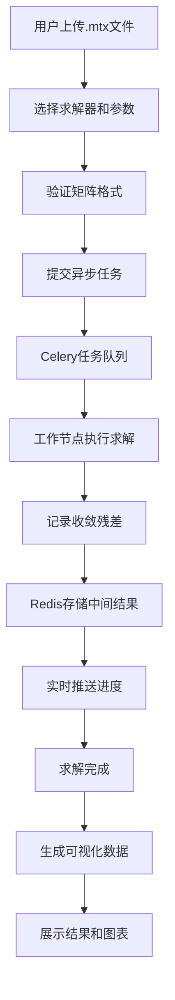

## 1. 产品概述

高性能稀疏矩阵线性方程组求解Web服务，支持用户上传Matrix Market格式的大规模稀疏矩阵文件，通过多种迭代法和直接法求解器计算Ax=b，并提供丰富的可视化分析功能。

- 核心价值：为科研和工程领域提供便捷的大规模稀疏线性系统求解服务
- 目标用户：计算数学研究者、工程仿真分析师、高性能计算从业人员
- 差异化优势：支持百万级规模矩阵、多种求解器选择、实时可视化分析

## 2. 核心功能

### 2.1 用户角色
| 角色 | 注册方式 | 核心权限 |
|------|----------|----------|
| 普通用户 | 无需注册（匿名使用） | 上传矩阵文件、提交求解任务、查看结果和可视化 |

### 2.2 功能模块
1. **主页**：矩阵文件上传、求解器选择、任务提交
2. **任务监控页**：实时任务状态、求解进度、历史任务列表
3. **结果可视化页**：矩阵统计信息、非零元分布热力图、收敛曲线、求解结果

### 2.3 页面详情
| 页面名称 | 模块名称 | 功能描述 |
|---------|----------|---------|
| 主页 | 文件上传区 | 拖拽上传Matrix Market格式文件（.mtx），显示文件信息和矩阵预览 |
| 主页 | 求解器配置区 | 选择求解器（CG/GMRES/SuperLU），配置迭代参数、容差、最大迭代次数 |
| 主页 | 任务提交区 | 生成随机b向量或自定义输入，提交求解任务 |
| 任务监控页 | 任务列表 | 显示所有历史任务，包括状态、进度、求解器类型、提交时间 |
| 任务监控页 | 实时状态 | 显示当前任务的执行进度、已用时间、预估剩余时间 |
| 结果可视化页 | 矩阵统计 | 显示矩阵维度、非零元数量、稀疏度、条件数估计 |
| 结果可视化页 | 非零元热力图 | 可视化展示矩阵非零元素的空间分布 |
| 结果可视化页 | 收敛曲线 | 迭代法残差收敛过程的实时曲线图 |
| 结果可视化页 | 求解结果 | 显示求解时间、迭代次数、解向量前10个元素 |

## 3. 核心流程

用户上传Matrix Market格式的稀疏矩阵文件 → 选择求解器类型并配置参数 → 系统解析矩阵并验证格式 → 提交异步求解任务 → Celery分配任务给工作节点 → 执行求解并记录中间结果 → 实时推送进度和收敛数据 → 求解完成后生成可视化图表和结果报告 → 用户查看求解时间、迭代次数、解向量及可视化分析。

## 4. 用户界面设计

### 4.1 设计风格
- **设计理念**：科技感、专业、高效，符合科学计算软件的美学
- **主色调**：深空蓝 (#0F172A) 作为背景，电光蓝 (#3B82F6) 作为主色，翡翠绿 (#10B981) 表示成功，琥珀橙 (#F59E0B) 表示警告
- **字体**：JetBrains Mono 作为代码和数据展示字体，Inter 作为界面字体
- **布局风格**：卡片式布局，分区明确，信息层级清晰
- **动效**：数据加载时的脉冲动画，图表渲染的渐入效果，进度条的平滑过渡

### 4.2 页面设计概述
| 页面名称 | 模块名称 | UI元素 |
|---------|----------|--------|
| 主页 | 文件上传区 | 深色卡片，虚线边框，拖拽高亮，文件图标，进度条 |
| 主页 | 求解器选择 | 单选按钮组，卡片式选中效果，求解器说明提示 |
| 主页 | 参数配置 | 数字输入框，滑块控件，单位标签，默认值提示 |
| 任务监控页 | 任务列表 | 数据表格，状态标签（排队/计算中/完成/失败），进度条 |
| 结果可视化页 | 热力图 | Canvas绘制的矩阵热力图，颜色渐变图例，缩放控件 |
| 结果可视化页 | 收敛曲线 | Chart.js折线图，对数坐标轴，实时数据点标记 |
| 结果可视化页 | 结果卡片 | 大字号关键指标，网格布局，图标+数值组合 |

### 4.3 响应式
- 桌面端：三栏布局（左侧配置、中间可视化、右侧结果）
- 平板端：两栏布局，自适应堆叠
- 移动端：单列布局，优先展示核心功能

### 4.4 交互细节
- 文件拖拽上传时边框变色和阴影增强
- 求解器卡片hover时轻微上浮和发光效果
- 进度条使用渐变色填充，末端有脉冲动画
- 图表数据点hover时显示详细数值
- 长任务执行时显示预估剩余时间和动态提示
