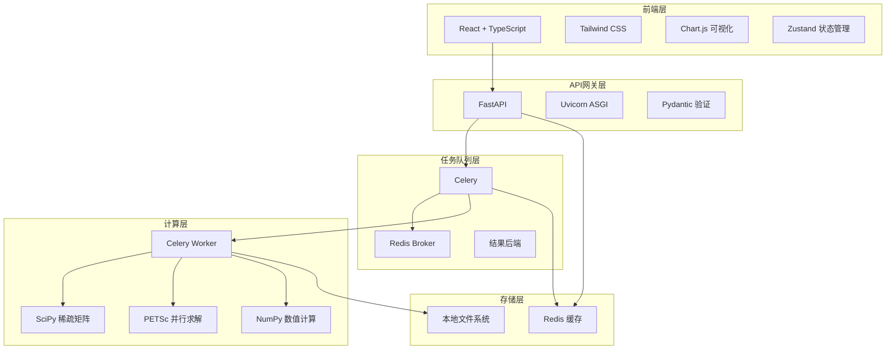
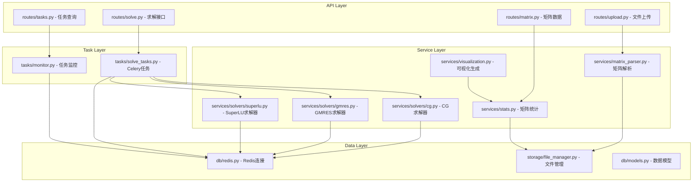
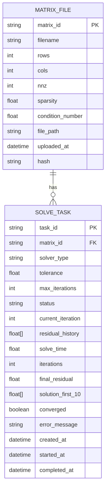

## 1. 架构设计



## 2. 技术描述

- **前端**：React@18 + TypeScript + Vite + TailwindCSS@3 + Chart.js + Zustand + lucide-react
- **后端**：Python 3.11 + FastAPI@0.109 + Uvicorn
- **任务队列**：Celery@5.3 + Redis@7.2
- **数值计算**：SciPy@1.11 + NumPy@1.26 + PETSc（可选编译）
- **文件格式支持**：scipy.io.mmread 解析 Matrix Market 格式

## 3. 路由定义

| 路由 | 方法 | 用途 |
|-------|------|-------|
| / | GET | 主页 - 文件上传和求解配置 |
| /tasks | GET | 任务列表页 |
| /tasks/:id | GET | 任务详情和结果页 |
| /api/v1/upload | POST | 上传矩阵文件 |
| /api/v1/solve | POST | 提交求解任务 |
| /api/v1/tasks/:id | GET | 查询任务状态和结果 |
| /api/v1/tasks/:id/progress | GET | 获取任务实时进度 |
| /api/v1/tasks | GET | 获取所有任务列表 |
| /api/v1/matrix/:id/heatmap | GET | 获取矩阵热力图数据 |
| /api/v1/matrix/:id/stats | GET | 获取矩阵统计信息 |

## 4. API 定义

```typescript
// 矩阵文件上传
interface UploadResponse {
  matrixId: string;
  filename: string;
  shape: [number, number];
  nnz: number;
  sparsity: number;
  conditionNumber: number | null;
}

// 求解任务提交
interface SolveRequest {
  matrixId: string;
  solver: 'cg' | 'gmres' | 'superlu';
  tol: number;
  maxIter: number;
  bVector?: number[];
}

interface SolveResponse {
  taskId: string;
  status: 'pending' | 'processing' | 'completed' | 'failed';
  createdAt: string;
}

// 任务状态
interface TaskStatus {
  taskId: string;
  status: 'pending' | 'processing' | 'completed' | 'failed';
  progress: number;
  currentIter: number;
  residualHistory: number[];
  elapsedTime: number;
  error?: string;
}

// 求解结果
interface SolveResult {
  taskId: string;
  solver: string;
  solveTime: number;
  iterations: number;
  finalResidual: number;
  solutionFirst10: number[];
  converged: boolean;
}

// 矩阵统计
interface MatrixStats {
  matrixId: string;
  shape: [number, number];
  nnz: number;
  sparsity: number;
  conditionNumber: number;
  rowNonzeroStats: { mean: number; std: number; max: number };
  colNonzeroStats: { mean: number; std: number; max: number };
}

// 热力图数据
interface HeatmapData {
  matrixId: string;
  rows: number;
  cols: number;
  downsampledData: { x: number; y: number; value: number }[];
  bins: { x: number; y: number; count: number }[];
}
```

## 5. 服务器架构图



## 6. 数据模型

### 6.1 数据模型定义



### 6.2 数据存储结构

Redis键设计：

```
matrix:{matrix_id}           - 矩阵元数据哈希
matrix:{matrix_id}:stats     - 矩阵统计信息哈希
task:{task_id}               - 任务状态哈希
task:{task_id}:residuals     - 残差历史列表
tasks:active                 - 活跃任务集合
tasks:recent                 - 最近任务列表
```

文件系统结构：
```
uploads/
  {matrix_id}/
    matrix.mtx              - 原始矩阵文件
    matrix.npz              - 序列化稀疏矩阵
    stats.json              - 预处理统计信息
results/
  {task_id}/
    solution.npy            - 完整解向量
    residuals.json          - 残差历史
    result.json             - 求解结果摘要
```
