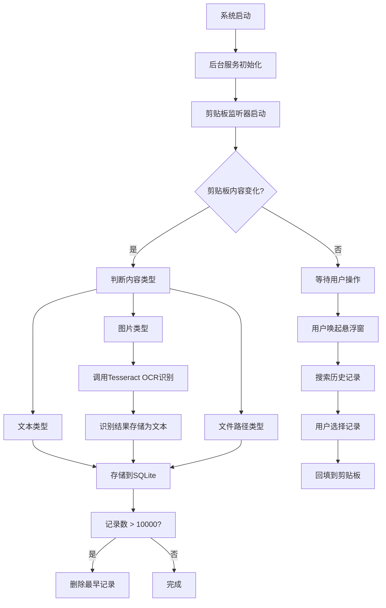

## 1. 产品概述

ClipMaster 是一款功能强大的跨平台剪贴板管理器桌面应用，旨在解决用户复制粘贴历史丢失、无法快速检索历史内容、图片文字无法提取等痛点。通过监听系统剪贴板变化，智能存储和管理复制历史，支持全文检索、OCR文字识别、悬浮窗快捷操作等功能，显著提升用户的工作效率。

- 核心价值：永久保存剪贴板历史，一秒定位所需内容，智能识别图片文字
- 目标用户：办公人员、程序员、内容创作者、学生等高频使用复制粘贴的用户

## 2. 核心功能

### 2.1 用户角色

| 角色 | 注册方式 | 核心权限 |
|------|----------|----------|
| 普通用户 | 无需注册，本地使用 | 使用所有核心功能，管理剪贴板历史 |

### 2.2 功能模块

1. **主界面**：剪贴板历史列表、搜索框、分类筛选、设置面板
2. **悬浮窗**：全局快捷键唤起、快速搜索、双击回填
3. **系统托盘**：后台运行、快捷菜单、状态显示
4. **设置页面**：通用设置、同步设置、数据库管理、关于

### 2.3 功能详情

| 页面名称 | 模块名称 | 功能描述 |
|----------|----------|----------|
| 主界面 | 历史列表 | 展示所有剪贴板记录，支持文本/图片/文件类型图标标识 |
| 主界面 | 全文搜索 | 实时搜索文本历史记录，高亮匹配关键词 |
| 主界面 | 分类筛选 | 按类型（文本/图片/文件）筛选历史记录 |
| 主界面 | 记录操作 | 复制、删除、收藏、查看详情 |
| 悬浮窗 | 快速搜索 | 全局快捷键唤起，输入即搜，支持上下键选择 |
| 悬浮窗 | 内容回填 | 双击记录自动复制到系统剪贴板 |
| 系统托盘 | 后台运行 | 最小化到托盘，不占用任务栏空间 |
| 系统托盘 | 快捷菜单 | 快速打开主窗口、退出应用、设置选项 |
| 设置页面 | 通用设置 | 最大记录数、启动选项、快捷键设置 |
| 设置页面 | OCR设置 | Tesseract路径配置、语言包选择 |
| 设置页面 | 同步设置 | 局域网同步开关、端口配置、设备发现 |
| 设置页面 | 数据库管理 | 手动清理、压缩数据库、导出备份 |

## 3. 核心流程

## 4. 用户界面设计

### 4.1 设计风格
- **主色调**：深靛蓝 (#1e40af) - 专业、稳重
- **强调色**：天青蓝 (#0ea5e9) - 活跃、交互
- **背景色**：深灰 (#0f172a) - 护眼、现代
- **字体**：Inter - 简洁、易读
- **风格**：深色模式优先、玻璃拟态效果、微动画过渡

### 4.2 页面设计概览

| 页面名称 | 模块名称 | UI元素 |
|----------|----------|--------|
| 主界面 | 顶部导航 | 搜索框（圆角、聚焦动画）、分类Tab（滑动指示器）、设置按钮 |
| 主界面 | 历史列表 | 卡片式布局、时间戳、类型图标、悬停高亮、渐入动画 |
| 主界面 | 侧边栏 | 收藏夹、统计信息、快捷操作 |
| 悬浮窗 | 搜索框 | 全屏居中、毛玻璃背景、实时高亮匹配 |
| 悬浮窗 | 结果列表 | 简洁列表、键盘导航、选中态动画 |
| 设置页面 | 分组卡片 | 分组标题、开关组件、输入框、下拉选择 |

### 4.3 响应性
- 桌面端优先，窗口支持自由拖拽缩放
- 悬浮窗固定尺寸，居中显示
- 列表区域支持滚动，内容自适应

### 4.4 交互细节
- 列表项悬停时背景渐变，显示操作按钮
- 搜索输入时实时过滤，带加载动画
- 双击记录时有复制成功的toast提示
- 窗口切换有平滑的淡入淡出效果
