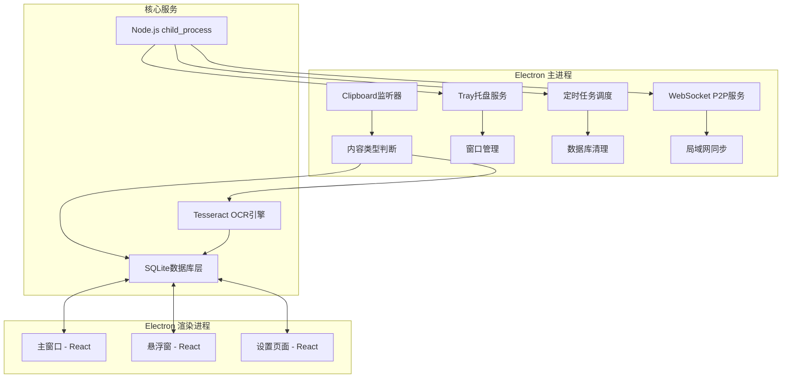
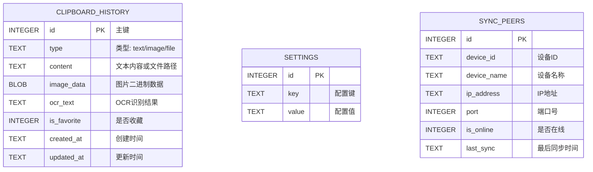

## 1. 架构设计



## 2. 技术栈描述

- **桌面框架**: Electron@29 + Electron Builder
- **前端框架**: React@18 + TypeScript + Vite
- **样式方案**: TailwindCSS@3 + Framer Motion（动画）
- **状态管理**: Zustand
- **数据库**: better-sqlite3 + SQLite
- **OCR引擎**: Tesseract.js + node-tesseract-ocr
- **IPC通信**: Electron IPC Main/Renderer
- **局域网同步**: ws (WebSocket) + Bonjour (服务发现)
- **定时任务**: node-cron
- **构建工具**: electron-vite

## 3. 目录结构

```
clipmaster/
├── src/
│   ├── main/              # Electron主进程
│   │   ├── index.ts       # 主入口
│   │   ├── clipboard.ts   # 剪贴板监听
│   │   ├── database.ts    # SQLite封装
│   │   ├── ocr.ts         # OCR服务
│   │   ├── tray.ts        # 系统托盘
│   │   ├── scheduler.ts   # 定时任务
│   │   ├── sync.ts        # WebSocket同步
│   │   └── ipc.ts         # IPC处理器
│   ├── preload/           # 预加载脚本
│   │   └── index.ts
│   └── renderer/          # React渲染进程
│       ├── components/    # 公共组件
│       ├── pages/         # 页面组件
│       │   ├── Main/      # 主窗口
│       │   ├── Float/     # 悬浮窗
│       │   └── Settings/  # 设置页
│       ├── store/         # Zustand状态
│       ├── utils/         # 工具函数
│       └── App.tsx
├── database/              # SQLite数据库文件
├── public/                # 静态资源
├── package.json
├── electron.vite.config.ts
└── tsconfig.json
```

## 4. 数据模型

### 4.1 ER图



### 4.2 DDL语句

```sql
-- 剪贴板历史表
CREATE TABLE IF NOT EXISTS clipboard_history (
    id INTEGER PRIMARY KEY AUTOINCREMENT,
    type TEXT NOT NULL CHECK(type IN ('text', 'image', 'file')),
    content TEXT,
    image_data BLOB,
    ocr_text TEXT,
    is_favorite INTEGER DEFAULT 0,
    created_at DATETIME DEFAULT CURRENT_TIMESTAMP,
    updated_at DATETIME DEFAULT CURRENT_TIMESTAMP
);

-- 全文检索索引
CREATE VIRTUAL TABLE IF NOT EXISTS clipboard_fts USING fts5(
    content,
    ocr_text,
    content='clipboard_history',
    content_rowid='id'
);

-- 设置表
CREATE TABLE IF NOT EXISTS settings (
    id INTEGER PRIMARY KEY AUTOINCREMENT,
    key TEXT UNIQUE NOT NULL,
    value TEXT
);

-- 同步设备表
CREATE TABLE IF NOT EXISTS sync_peers (
    id INTEGER PRIMARY KEY AUTOINCREMENT,
    device_id TEXT UNIQUE NOT NULL,
    device_name TEXT,
    ip_address TEXT,
    port INTEGER,
    is_online INTEGER DEFAULT 0,
    last_sync DATETIME
);

-- 索引优化
CREATE INDEX IF NOT EXISTS idx_history_type ON clipboard_history(type);
CREATE INDEX IF NOT EXISTS idx_history_created ON clipboard_history(created_at DESC);
CREATE INDEX IF NOT EXISTS idx_history_favorite ON clipboard_history(is_favorite);
```

## 5. IPC通信定义

```typescript
// 主进程 -> 渲染进程 通道
type IpcChannels = {
  // 剪贴板操作
  'clipboard:new': (item: ClipboardItem) => void;
  'clipboard:list': (items: ClipboardItem[]) => void;
  'clipboard:search': (items: ClipboardItem[]) => void;
  
  // 数据库操作
  'db:insert': (id: number) => void;
  'db:delete': (success: boolean) => void;
  'db:cleanup': (deletedCount: number) => void;
  
  // OCR操作
  'ocr:start': (id: number) => void;
  'ocr:complete': (id: number, text: string) => void;
  'ocr:error': (id: number, error: string) => void;
  
  // 同步操作
  'sync:peer-found': (peer: PeerInfo) => void;
  'sync:status': (status: 'connected' | 'disconnected') => void;
  'sync:progress': (progress: number) => void;
};

// 渲染进程 -> 主进程 调用
type IpcInvoke = {
  'clipboard:copy': (id: number) => Promise<boolean>;
  'clipboard:delete': (id: number) => Promise<boolean>;
  'clipboard:search': (query: string) => Promise<ClipboardItem[]>;
  'clipboard:list': (page: number, size: number) => Promise<{items: ClipboardItem[], total: number}>;
  
  'settings:get': (key: string) => Promise<string | null>;
  'settings:set': (key: string, value: string) => Promise<boolean>;
  
  'db:vacuum': () => Promise<boolean>;
  'db:export': (path: string) => Promise<boolean>;
  
  'sync:enable': () => Promise<boolean>;
  'sync:disable': () => Promise<boolean>;
  'sync:peers': () => Promise<PeerInfo[]>;
};
```

## 6. 核心模块设计

### 6.1 剪贴板监听器

```typescript
// 轮询策略：500ms检查一次，避免资源占用
// 内容哈希对比：避免重复记录相同内容
class ClipboardMonitor {
  private lastHash: string = '';
  private interval: NodeJS.Timeout | null = null;
  
  start() {
    this.interval = setInterval(async () => {
      const content = await this.readClipboard();
      const hash = this.computeHash(content);
      
      if (hash !== this.lastHash) {
        this.lastHash = hash;
        await this.processContent(content);
      }
    }, 500);
  }
  
  private async processContent(content: ClipboardContent) {
    // 1. 保存到数据库
    const id = await db.insert(content);
    
    // 2. 如果是图片，异步触发OCR
    if (content.type === 'image') {
      ocrService.recognize(id, content.imageData);
    }
    
    // 3. 检查记录数，超过限制则清理
    await db.checkAndCleanup();
    
    // 4. 通知渲染进程更新
    mainWindow?.webContents.send('clipboard:new', content);
  }
}
```

### 6.2 定时任务调度

```typescript
// 每周日凌晨3点执行数据库清理和压缩
const cronJobs = {
  weeklyCleanup: '0 0 3 * * 0',  // 周日 3:00 AM
};

class Scheduler {
  start() {
    // 每周清理任务
    cron.schedule(cronJobs.weeklyCleanup, async () => {
      console.log('Starting weekly database maintenance...');
      
      // 1. 删除超过10000条的旧记录（非收藏）
      const deleted = await db.cleanOldRecords(10000);
      console.log(`Deleted ${deleted} old records`);
      
      // 2. 压缩数据库
      await db.vacuum();
      console.log('Database vacuum completed');
    });
  }
}
```

### 6.3 WebSocket局域网同步

```typescript
// P2P对等网络架构，无中心节点
// 使用Bonjour/mDNS进行局域网设备发现
class SyncService {
  private wss: WebSocket.Server | null = null;
  private peers: Map<string, WebSocket> = new Map();
  
  async enable() {
    // 1. 启动WebSocket服务
    this.wss = new WebSocket.Server({ port: 8972 });
    
    // 2. 广播设备发现
    bonjour.publish({
      name: `ClipMaster-${os.hostname()}`,
      type: 'clipmaster',
      port: 8972,
      txt: { deviceId: this.deviceId }
    });
    
    // 3. 发现其他设备
    const browser = bonjour.find({ type: 'clipmaster' });
    browser.on('up', (service) => this.connectPeer(service));
  }
  
  private syncWithPeer(peerId: string) {
    // 增量同步：按时间戳对比
    // 冲突解决：以较新的记录为准
  }
}
```
