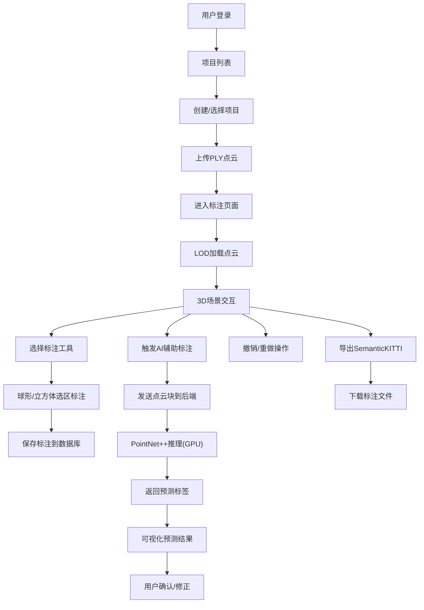

## 1. 产品概述
基于Web的3D点云智能标注工具，支持大规模点云数据的可视化、人工标注与AI辅助标注。结合Three.js前端与PyTorch后端，实现500万级点云的高效交互与语义分割标注。

- 面向自动驾驶、机器人感知等领域的点云数据标注人员
- 解决大规模点云标注效率低、精度差的问题
- 核心价值：AI辅助标注减少人工工作量70%以上

## 2. 核心 Features

### 2.1 User Roles
| 角色 | 注册方式 | 核心权限 |
|------|----------|----------|
| 标注员 | 账号登录 | 点云查看、标注、导出、AI辅助标注 |
| 管理员 | 账号登录 | 项目管理、用户管理、数据管理、模型管理 |

### 2.2 Feature Module
1. **点云加载模块**：PLY格式点云加载、500万点支持、LOD动态加载
2. **3D可视化模块**：Three.js渲染、相机控制、点云着色、标签颜色映射
3. **标注工具模块**：球形画笔、立方体选区、多类别标注（车辆/行人/建筑等）
4. **AI辅助模块**：PointNet++实时分割预测、GPU加速推理、批量处理
5. **历史管理模块**：撤销/重做、操作历史记录
6. **数据导出模块**：SemanticKITTI格式导出、标签ID存储
7. **项目管理模块**：点云文件管理、标注进度追踪

### 2.3 Page Details
| 页面名称 | 模块名称 | 功能描述 |
|----------|----------|----------|
| 登录页 | 用户认证 | 账号密码登录、Session管理 |
| 项目列表页 | 项目管理 | 项目创建、点云上传、标注进度显示 |
| 标注主页面 | 3D场景 | 点云渲染、相机交互、LOD加载 |
| 标注主页面 | 工具栏 | 画笔选择（球/立方体）、尺寸调节、标签选择 |
| 标注主页面 | 侧边栏 | 标签图例、操作历史、AI预测控制 |
| 标注主页面 | 顶部栏 | 撤销/重做、保存、导出、视图控制 |

## 3. 核心流程

用户登录后进入项目列表，选择或创建项目，上传PLY点云文件。进入标注页面后，系统通过LOD策略渐进式加载点云数据。用户使用球形或立方体画笔工具标注不同物体类别，可随时触发AI辅助标注，后端PointNet++模型实时返回分割预测结果，用户可快速修正。标注完成后可导出为SemanticKITTI格式。所有操作支持撤销/重做，数据实时保存到PostgreSQL数据库。

## 4. User Interface Design

### 4.1 Design Style
- 主色调：深蓝科技感 (#0F172A) 搭配青色高亮 (#06B6D4)
- 辅助色：标签类别使用高对比度区分色（车辆红、行人绿、建筑蓝等）
- 按钮风格：扁平化圆角按钮，悬浮微动效
- 字体：JetBrains Mono 作为代码和数字字体，Inter 作为界面字体
- 布局：暗色主题专业工具风格，三栏布局（侧边栏+3D视图+属性面板）
- 图标：简洁线性图标，统一设计风格

### 4.2 Page Design Overview
| 页面名称 | 模块名称 | UI Elements |
|----------|----------|-------------|
| 登录页 | 登录表单 | 居中卡片布局、渐变背景、输入框动效、登录按钮 |
| 项目列表页 | 项目卡片 | 网格布局、项目缩略图、进度条、操作按钮组 |
| 标注主页面 | 3D视口 | 全屏Canvas、悬浮工具栏、右上角视角指示器、左下角坐标轴 |
| 标注主页面 | 左侧边栏 | 标签色卡列表、图例、标注统计信息 |
| 标注主页面 | 顶部工具栏 | 撤销/重做按钮组、画笔模式切换、尺寸滑块、AI预测按钮 |
| 标注主页面 | 右侧面板 | 操作历史列表、点云信息、导出选项 |

### 4.3 Responsiveness
- 桌面端优先设计，最低支持1920x1080分辨率
- 3D视口自适应窗口大小
- 侧边栏可折叠，小屏幕自动隐藏
- 工具栏支持自定义排布

### 4.4 3D Scene Guidance
- 环境：暗色太空风格背景，无HDRI，突出点云本身
- 光照：点云使用顶点颜色，场景环境光 + 半球光，避免阴影
- 相机：透视相机，默认鸟瞰视角，支持轨道控制器（旋转/平移/缩放）
- 交互：鼠标左键旋转、右键平移、滚轮缩放，画笔选择时使用射线检测
- 后处理：轻微Bloom效果突出选中区域，边缘高亮
- 性能：点云使用BufferGeometry，LOD按距离分层渲染，每帧渲染点数控制在50万以内

## 5. 标注类别定义

| 标签ID | 类别名称 | 颜色 (HEX) | 说明 |
|--------|----------|------------|------|
| 0 | 未标注 | #808080 | 默认未标注点 |
| 1 | 车辆 | #FF0000 | 轿车、卡车、公交车等 |
| 2 | 行人 | #00FF00 | 行人、骑行者 |
| 3 | 建筑 | #0000FF | 建筑物、墙壁 |
| 4 | 植被 | #00FF7F | 树木、草地 |
| 5 | 道路 | #FFFF00 | 路面、车道线 |
| 6 | 人行道 | #FFA500 | 人行道、骑行道 |
| 7 | 围栏 | #FF00FF | 护栏、围栏 |
| 8 |  pole | #00FFFF | 电线杆、路灯 |
| 9 | 交通标志 | #FFC0CB | 标志牌、信号灯 |

