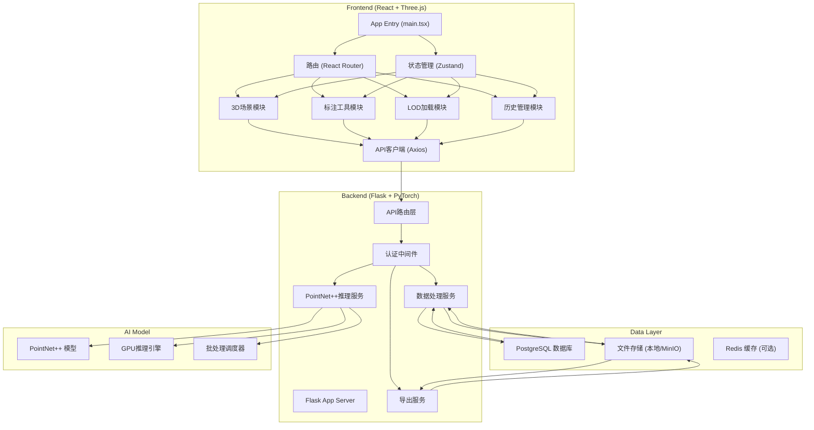
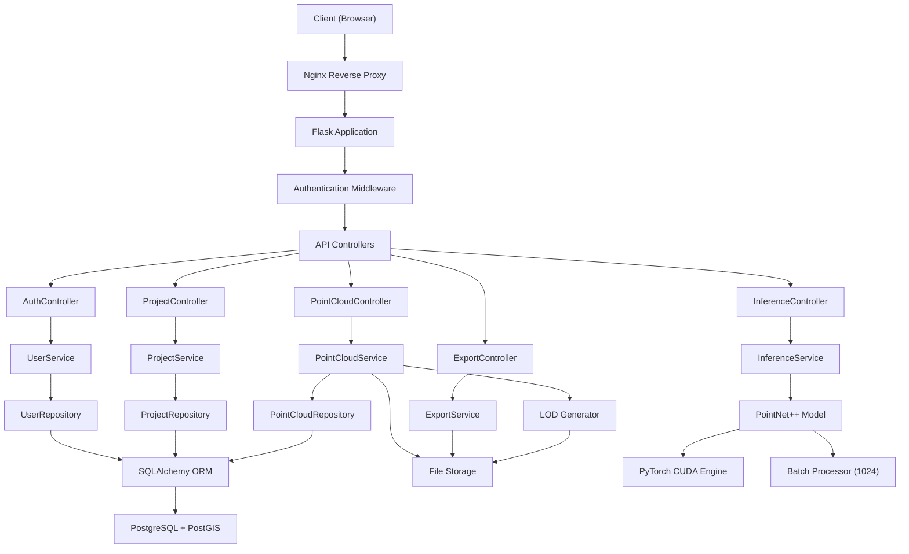
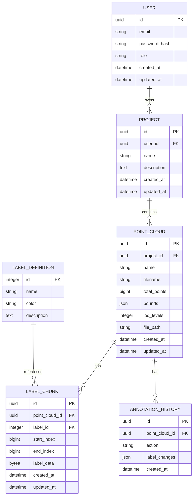

## 1. 架构设计



## 2. 技术栈说明

### 前端技术栈
- **框架**: React 18 + TypeScript
- **构建工具**: Vite 5
- **3D渲染**: Three.js r160 + @react-three/fiber + @react-three/drei
- **状态管理**: Zustand
- **路由**: React Router v6
- **HTTP客户端**: Axios
- **UI组件**: TailwindCSS 3 + Headless UI
- **图标**: Lucide React

### 后端技术栈
- **Web框架**: Flask 3.0 + Flask-RESTX
- **深度学习**: PyTorch 2.1 + torch-scatter + torch-sparse
- **点云处理**: Open3D 0.18 + plyfile
- **数据库**: PostgreSQL 15 + PostGIS + SQLAlchemy 2.0
- **认证**: Flask-JWT-Extended
- **异步任务**: Celery + Redis (可选)

### 核心依赖
- **PointNet++**: 基于PyTorch实现的PointNet++语义分割模型
- **Three.js PLYLoader**: 用于加载PLY格式点云
- **SemanticKITTI工具**: 用于标签格式转换

## 3. 目录结构

### 前端目录 (frontend/)
```
frontend/
├── src/
│   ├── components/
│   │   ├── auth/              # 登录注册组件
│   │   ├── layout/            # 布局组件
│   │   ├── toolbar/           # 工具栏组件
│   │   ├── sidebar/           # 侧边栏组件
│   │   └── viewer/            # 3D视口组件
│   ├── store/                 # Zustand状态管理
│   │   ├── useAnnotationStore.ts
│   │   ├── useHistoryStore.ts
│   │   └── usePointCloudStore.ts
│   ├── hooks/                 # 自定义Hooks
│   │   ├── useThreeScene.ts
│   │   ├── useBrushTool.ts
│   │   └── useLODLoader.ts
│   ├── services/              # API服务
│   │   ├── api.ts
│   │   ├── pointCloud.ts
│   │   └── inference.ts
│   ├── utils/                 # 工具函数
│   │   ├── pointCloudUtils.ts
│   │   ├── colorMap.ts
│   │   └── exportUtils.ts
│   ├── types/                 # TypeScript类型定义
│   ├── pages/                 # 页面组件
│   ├── App.tsx
│   └── main.tsx
├── public/
├── package.json
├── tsconfig.json
└── vite.config.ts
```

### 后端目录 (backend/)
```
backend/
├── app/
│   ├── __init__.py
│   ├── config.py              # 配置文件
│   ├── extensions.py          # 扩展初始化
│   ├── models/                # 数据库模型
│   │   ├── __init__.py
│   │   ├── user.py
│   │   ├── project.py
│   │   └── point_cloud.py
│   ├── routes/                # API路由
│   │   ├── __init__.py
│   │   ├── auth.py
│   │   ├── projects.py
│   │   ├── point_clouds.py
│   │   └── inference.py
│   ├── services/              # 业务逻辑
│   │   ├── __init__.py
│   │   ├── point_cloud_service.py
│   │   ├── inference_service.py
│   │   └── export_service.py
│   ├── ml/                    # 机器学习模块
│   │   ├── __init__.py
│   │   ├── pointnet2/         # PointNet++模型实现
│   │   │   ├── __init__.py
│   │   │   ├── model.py
│   │   │   └── modules.py
│   │   ├── inference_engine.py
│   │   └── preprocess.py
│   └── utils/                 # 工具函数
├── models/                    # 预训练模型权重
├── uploads/                   # 上传文件存储
├── exports/                   # 导出文件存储
├── requirements.txt
├── run.py
└── wsgi.py
```

## 4. 路由定义

| 路由 | 方法 | 用途 |
|------|------|------|
| /api/auth/login | POST | 用户登录 |
| /api/auth/refresh | POST | 刷新Token |
| /api/projects | GET | 获取项目列表 |
| /api/projects | POST | 创建新项目 |
| /api/projects/:id | GET | 获取项目详情 |
| /api/projects/:id/point-clouds | GET | 获取点云列表 |
| /api/point-clouds/upload | POST | 上传PLY点云文件 |
| /api/point-clouds/:id | GET | 获取点云元数据 |
| /api/point-clouds/:id/lod/:level | GET | 获取指定LOD层级点云块 |
| /api/point-clouds/:id/labels | GET | 获取点云标签数据 |
| /api/point-clouds/:id/labels | PUT | 批量更新点云标签 |
| /api/inference/predict | POST | PointNet++推理预测 |
| /api/point-clouds/:id/export | GET | 导出SemanticKITTI格式 |
| /api/point-clouds/:id/history | GET | 获取操作历史 |
| /api/point-clouds/:id/history/:version | POST | 恢复到历史版本 |

## 5. API 类型定义

```typescript
// Point Cloud Types
interface PointCloud {
  id: string;
  projectId: string;
  name: string;
  filename: string;
  totalPoints: number;
  bounds: {
    min: [number, number, number];
    max: [number, number, number];
  };
  lodLevels: number;
  createdAt: string;
  updatedAt: string;
}

interface PointCloudChunk {
  points: Float32Array;  // xyz * N
  colors?: Uint8Array;   // rgb * N
  labels?: Uint32Array;  // label * N
  chunkId: string;
  lodLevel: number;
}

// Label Types
interface LabelDefinition {
  id: number;
  name: string;
  color: string;  // HEX
  description: string;
}

interface LabelUpdateRequest {
  pointCloudId: string;
  pointIndices: number[];
  labelId: number;
}

interface BatchLabelUpdateRequest {
  pointCloudId: string;
  updates: Array<{
    startIndex: number;
    endIndex: number;
    labelId: number;
  }>;
}

// Inference Types
interface InferenceRequest {
  pointCloudId: string;
  pointIndices: number[];  // 需要预测的点索引
  batchSize?: number;      // 默认1024
}

interface InferenceResponse {
  predictions: Array<{
    pointIndex: number;
    predictedLabel: number;
    confidence: number;
  }>;
  processingTime: number;
}

// History Types
interface HistoryEntry {
  id: string;
  timestamp: string;
  action: string;
  labelChanges: Array<{
    pointIndex: number;
    oldLabel: number;
    newLabel: number;
  }>;
}
```

## 6. 服务器架构图



## 7. 数据模型

### 7.1 ER Diagram



### 7.2 DDL Statements

```sql
-- Enable PostGIS extension
CREATE EXTENSION IF NOT EXISTS postgis;
CREATE EXTENSION IF NOT EXISTS "uuid-ossp";

-- User table
CREATE TABLE users (
    id UUID PRIMARY KEY DEFAULT uuid_generate_v4(),
    email VARCHAR(255) UNIQUE NOT NULL,
    password_hash VARCHAR(255) NOT NULL,
    role VARCHAR(50) NOT NULL DEFAULT 'annotator',
    created_at TIMESTAMP WITH TIME ZONE DEFAULT CURRENT_TIMESTAMP,
    updated_at TIMESTAMP WITH TIME ZONE DEFAULT CURRENT_TIMESTAMP
);

-- Project table
CREATE TABLE projects (
    id UUID PRIMARY KEY DEFAULT uuid_generate_v4(),
    user_id UUID REFERENCES users(id) ON DELETE CASCADE,
    name VARCHAR(255) NOT NULL,
    description TEXT,
    created_at TIMESTAMP WITH TIME ZONE DEFAULT CURRENT_TIMESTAMP,
    updated_at TIMESTAMP WITH TIME ZONE DEFAULT CURRENT_TIMESTAMP
);

-- Point cloud table
CREATE TABLE point_clouds (
    id UUID PRIMARY KEY DEFAULT uuid_generate_v4(),
    project_id UUID REFERENCES projects(id) ON DELETE CASCADE,
    name VARCHAR(255) NOT NULL,
    filename VARCHAR(255) NOT NULL,
    total_points BIGINT NOT NULL,
    bounds JSONB NOT NULL,
    lod_levels INTEGER NOT NULL DEFAULT 3,
    file_path VARCHAR(500) NOT NULL,
    created_at TIMESTAMP WITH TIME ZONE DEFAULT CURRENT_TIMESTAMP,
    updated_at TIMESTAMP WITH TIME ZONE DEFAULT CURRENT_TIMESTAMP
);

-- Label definitions table (static reference data)
CREATE TABLE label_definitions (
    id INTEGER PRIMARY KEY,
    name VARCHAR(100) UNIQUE NOT NULL,
    color VARCHAR(7) NOT NULL,
    description TEXT
);

-- Label chunks table (stores label data efficiently)
CREATE TABLE label_chunks (
    id UUID PRIMARY KEY DEFAULT uuid_generate_v4(),
    point_cloud_id UUID REFERENCES point_clouds(id) ON DELETE CASCADE,
    label_id INTEGER REFERENCES label_definitions(id),
    start_index BIGINT NOT NULL,
    end_index BIGINT NOT NULL,
    label_data BYTEA,
    created_at TIMESTAMP WITH TIME ZONE DEFAULT CURRENT_TIMESTAMP,
    updated_at TIMESTAMP WITH TIME ZONE DEFAULT CURRENT_TIMESTAMP
);

-- Annotation history table
CREATE TABLE annotation_history (
    id UUID PRIMARY KEY DEFAULT uuid_generate_v4(),
    point_cloud_id UUID REFERENCES point_clouds(id) ON DELETE CASCADE,
    action VARCHAR(100) NOT NULL,
    label_changes JSONB NOT NULL,
    created_at TIMESTAMP WITH TIME ZONE DEFAULT CURRENT_TIMESTAMP
);

-- Indexes
CREATE INDEX idx_point_clouds_project_id ON point_clouds(project_id);
CREATE INDEX idx_label_chunks_point_cloud_id ON label_chunks(point_cloud_id);
CREATE INDEX idx_label_chunks_range ON label_chunks(point_cloud_id, start_index, end_index);
CREATE INDEX idx_annotation_history_pc_id ON annotation_history(point_cloud_id);

-- Insert default label definitions
INSERT INTO label_definitions (id, name, color, description) VALUES
(0, '未标注', '#808080', '默认未标注点'),
(1, '车辆', '#FF0000', '轿车、卡车、公交车等'),
(2, '行人', '#00FF00', '行人、骑行者'),
(3, '建筑', '#0000FF', '建筑物、墙壁'),
(4, '植被', '#00FF7F', '树木、草地'),
(5, '道路', '#FFFF00', '路面、车道线'),
(6, '人行道', '#FFA500', '人行道、骑行道'),
(7, '围栏', '#FF00FF', '护栏、围栏'),
(8, '杆状物', '#00FFFF', '电线杆、路灯'),
(9, '交通标志', '#FFC0CB', '标志牌、信号灯');
```

## 8. 核心技术设计

### 8.1 LOD 动态加载策略
- **层级划分**: Level 0 (全分辨率，500万点), Level 1 (250万点), Level 2 (125万点), Level 3 (62万点)
- **分块策略**: 八叉树空间划分，每块最多10万个点
- **加载策略**: 根据相机距离自动切换LOD层级，预加载相邻块
- **传输格式**: Binary ArrayBuffer，支持gzip压缩

### 8.2 PointNet++ 推理设计
- **输入**: 点坐标 (N, 3) + 可选颜色 (N, 3)
- **批处理**: 固定batch size = 1024，GPU并行处理
- **输出**: 每个点的类别预测 (N,) + 置信度 (N,)
- **性能**: RTX 3090 上约 5000 点/秒
- **模型**: PointNet++ MSG (Multi-Scale Grouping)

### 8.3 标注历史管理
- **命令模式**: 每个标注操作为一个Command对象
- **快照存储**: 存储修改前的标签值，支持快速回滚
- **历史栈**: 最大保存100步操作，超出自动压缩

### 8.4 性能优化
- **WebWorker**: 点云数据解析在Worker线程进行
- **BufferGeometry**: 使用Three.js BufferGeometry，避免频繁数据上传
- **视锥体剔除**: 只渲染视锥体内的点云块
- **GPU实例化**: 点精灵使用InstancedBufferGeometry

## 9. 安全设计

### 9.1 认证授权
- JWT Token认证，Access Token有效期15分钟
- Refresh Token用于续期，有效期7天
- 基于角色的访问控制(RBAC)

### 9.2 数据安全
- 点云文件上传进行格式验证和大小限制
- SQL注入防护：使用SQLAlchemy参数化查询
- XSS防护：前端渲染时进行HTML转义

### 9.3 文件上传安全
- 文件类型白名单：仅允许 .ply 文件
- 最大文件大小：5GB
- 病毒扫描（可选，集成ClamAV）
