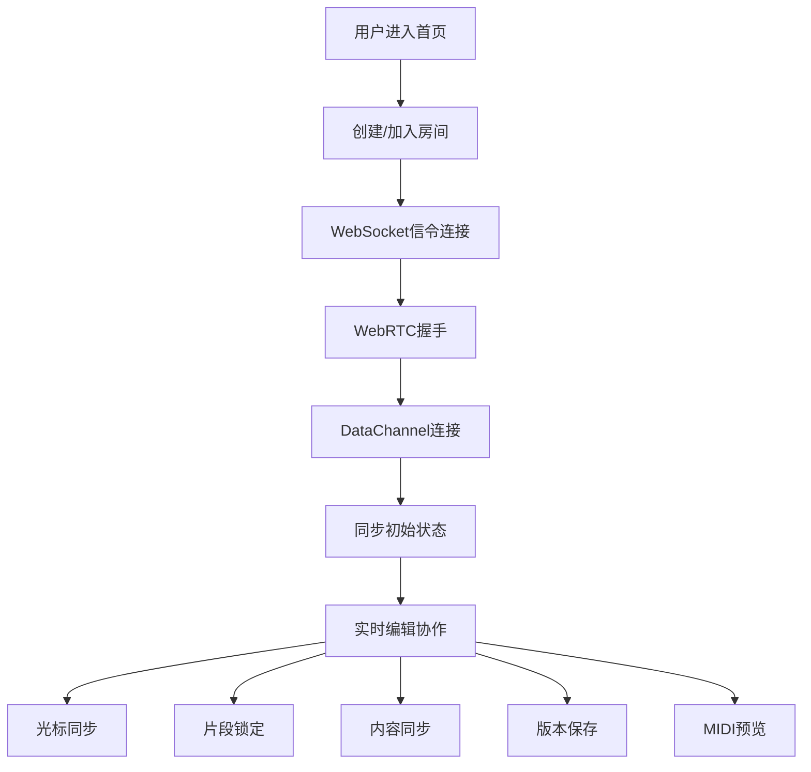

## 1. 产品概述

WebRTC实时协同乐谱编辑器是一款支持多人同时编辑ABC记谱法格式乐谱的在线协作工具。通过WebRTC点对点通信技术，实现低延迟的实时协作体验，让音乐创作者能够远程协同完成乐谱创作。

- **主要用途**：音乐创作、教育、乐团排练中的乐谱协同编辑
- **解决问题**：传统乐谱编辑软件缺乏实时协作功能，远程团队难以高效协同创作
- **目标用户**：音乐教师、学生、作曲家、乐团指挥、音乐爱好者
- **产品价值**：提供低延迟、高可靠性的实时协同编辑体验，结合版本历史和MIDI预览，提升音乐创作效率

## 2. 核心功能

### 2.1 用户角色

| 角色 | 注册方式 | 核心权限 |
|------|----------|----------|
| 协作者 | 匿名加入房间 | 编辑乐谱、查看光标、播放MIDI、查看版本历史 |
| 房间创建者 | 输入房间名创建 | 所有协作者权限 + 管理房间、锁定/解锁片段 |

### 2.2 功能模块

1. **编辑器页面**：ABC记谱法代码编辑器、实时乐谱渲染、协作者状态面板
2. **协作控制**：房间创建/加入、用户列表、光标同步、片段锁定
3. **版本历史**：历史记录列表、版本对比、回滚功能
4. **MIDI播放**：实时预览、播放控制、速度调节

### 2.3 页面详情

| 页面名称 | 模块名称 | 功能描述 |
|---------|----------|----------|
| 首页 | 房间入口 | 创建新房间、输入房间号加入、快速开始演示 |
| 编辑器 | 代码编辑区 | ABC语法高亮、行号显示、自动补全、多光标支持 |
| 编辑器 | 乐谱预览区 | 实时渲染五线谱、缩放控制、打印导出 |
| 编辑器 | 协作面板 | 在线用户列表、光标位置显示、锁定状态指示 |
| 编辑器 | 版本面板 | 历史版本列表、时间戳、作者信息、回滚按钮 |
| 编辑器 | 播放控制 | 播放/暂停、进度条、速度调节、音量控制 |

## 3. 核心流程

### 用户协作流程
1. 用户进入首页，创建新房间或输入房间号加入
2. 系统通过WebSocket建立信令连接，交换WebRTC SDP和ICE信息
3. 建立WebRTC DataChannel点对点连接
4. 加入房间时同步当前乐谱状态和版本历史
5. 编辑时实时同步光标位置和内容变更
6. 编辑特定小节时自动锁定，防止冲突
7. 支持随时保存版本、查看历史、回滚到旧版本
8. 使用MIDI实时预览播放乐谱

## 4. 用户界面设计

### 4.1 设计风格
- **主色调**：深靛蓝 (#1e3a5f) - 代表专业与创造力
- **辅助色**：琥珀橙 (#f59e0b) - 用于强调交互元素和光标指示
- **成功色**：翠绿 (#10b981) - 表示连接正常和锁定状态
- **警告色**：玫红 (#ef4444) - 表示断开连接和冲突
- **字体**：标题使用 Playfair Display（优雅的衬线字体，符合音乐艺术气质），正文使用 JetBrains Mono（等宽字体，适合代码编辑）
- **按钮风格**：圆角矩形，微立体阴影，悬停时轻微上浮
- **布局风格**：三栏布局（左侧协作面板、中间编辑区、右侧乐谱预览），顶部工具栏
- **图标风格**：使用lucide-react线性图标，保持简洁统一

### 4.2 页面设计概述

| 页面名称 | 模块名称 | UI元素 |
|---------|----------|--------|
| 首页 | 房间入口 | 渐变背景、大型标题、卡片式入口、动画过渡效果 |
| 编辑器 | 代码编辑区 | 深色主题、语法高亮、行号、折叠箭头、当前行高亮 |
| 编辑器 | 乐谱预览区 | 浅色背景、五线谱渲染、页码、缩放控件 |
| 编辑器 | 协作面板 | 用户头像、彩色光标标识、锁定图标、在线状态 |
| 编辑器 | 版本面板 | 时间线布局、版本卡片、差异对比视图 |
| 编辑器 | 播放控制 | 底部浮动控制条、波形进度、播放按钮组 |

### 4.3 响应性
- **桌面端**：三栏固定布局，编辑区占据主要空间
- **平板端**：两栏布局，协作面板可折叠
- **移动端**：单栏布局，Tab切换编辑/预览/协作
- **触摸优化**：增大按钮点击区域，支持手势缩放乐谱

### 4.4 视觉动效
- 页面加载时的渐入动画和元素错位展示
- 光标移动时的平滑过渡
- 锁定/解锁时的图标旋转动画
- 版本保存成功的脉冲反馈
- MIDI播放时的音符高亮流动效果
