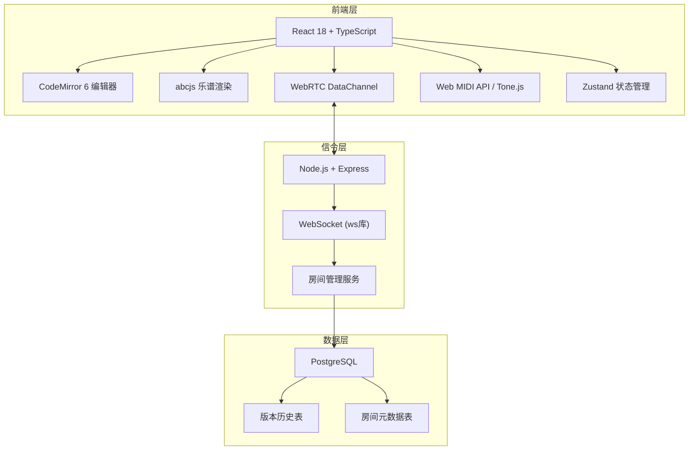
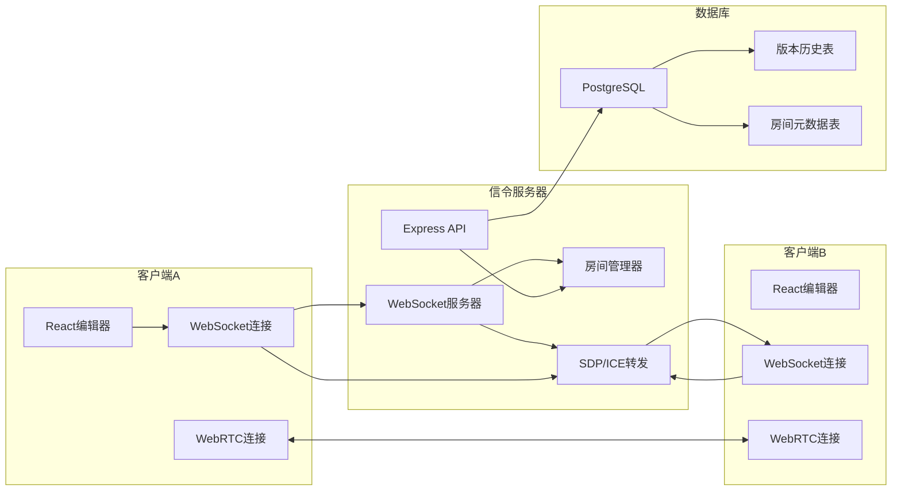
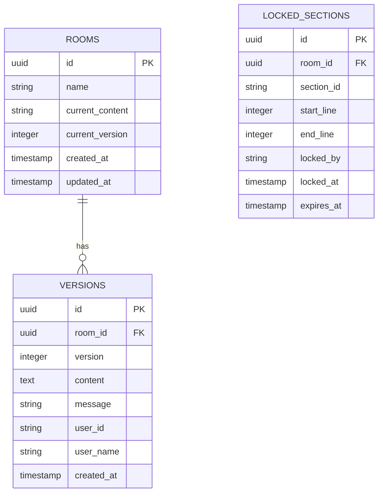

## 1. 架构设计



## 2. 技术描述

- **前端框架**：React@18 + TypeScript@5 + Vite@6
- **样式方案**：TailwindCSS@3
- **状态管理**：Zustand@4
- **路由管理**：react-router-dom@6
- **代码编辑器**：CodeMirror@6（支持ABC语法高亮）
- **乐谱渲染**：abcjs@6
- **MIDI播放**：Web MIDI API + Tone.js
- **图标库**：lucide-react@0.344
- **后端框架**：Express@4 + TypeScript
- **WebSocket**：ws@8
- **WebRTC**：原生RTCPeerConnection + simple-peer封装
- **数据库**：PostgreSQL@15 + pg@8
- **项目初始化**：vite-init (react-express-ts模板)

## 3. 核心技术架构说明

### WebRTC连接流程
1. 客户端通过WebSocket连接信令服务器
2. 发起方创建Offer，通过信令服务器发送给接收方
3. 接收方创建Answer，通过信令服务器返回
4. 双方交换ICE候选者
5. 建立DataChannel用于实时数据传输

### 协作同步机制
- **操作转换(OT)**：基于CRDT算法实现无冲突的并发编辑
- **光标同步**：每秒发送10次光标位置，使用节流优化
- **片段锁定**：基于ABC小节边界，编辑时自动锁定范围3秒，超时自动释放

## 4. 路由定义

| 路由 | 页面 | 说明 |
|------|------|------|
| `/` | 首页 | 房间创建/加入入口 |
| `/room/:roomId` | 编辑器页面 | 主协作编辑界面 |
| `/demo` | 演示页面 | 无连接的本地演示模式 |

## 5. API 定义

### WebSocket信令消息类型

```typescript
// 信令消息基类
interface SignalingMessage {
  type: string;
  roomId: string;
  userId: string;
  timestamp: number;
}

// SDP交换
interface OfferMessage extends SignalingMessage {
  type: 'offer';
  targetId: string;
  sdp: RTCSessionDescriptionInit;
}

interface AnswerMessage extends SignalingMessage {
  type: 'answer';
  targetId: string;
  sdp: RTCSessionDescriptionInit;
}

// ICE候选
interface IceCandidateMessage extends SignalingMessage {
  type: 'ice-candidate';
  targetId: string;
  candidate: RTCIceCandidateInit;
}

// 房间管理
interface JoinRoomMessage extends SignalingMessage {
  type: 'join-room';
  userName: string;
}

interface RoomStateMessage extends SignalingMessage {
  type: 'room-state';
  users: User[];
  currentScore: string;
  lockedSections: LockedSection[];
}
```

### WebRTC DataChannel 消息类型

```typescript
interface DataChannelMessage {
  type: string;
  userId: string;
  timestamp: number;
}

// 光标同步
interface CursorMessage extends DataChannelMessage {
  type: 'cursor';
  position: { line: number; ch: number };
  selection?: { anchor: Position; head: Position };
}

// 内容变更
interface ContentChangeMessage extends DataChannelMessage {
  type: 'content-change';
  changes: EditorChange[];
  version: number;
}

// 片段锁定
interface SectionLockMessage extends DataChannelMessage {
  type: 'section-lock';
  sectionId: string;
  locked: boolean;
  range: { start: number; end: number };
}

// 版本保存
interface SaveVersionMessage extends DataChannelMessage {
  type: 'save-version';
  content: string;
  message: string;
}
```

### REST API

```typescript
// 获取房间版本历史
GET /api/rooms/:roomId/versions
Response: {
  versions: Array<{
    id: string;
    version: number;
    content: string;
    message: string;
    userId: string;
    userName: string;
    createdAt: string;
  }>
}

// 保存新版本
POST /api/rooms/:roomId/versions
Request: {
  content: string;
  message: string;
  userId: string;
  userName: string;
}
Response: { versionId: string; version: number }

// 回滚到指定版本
POST /api/rooms/:roomId/versions/:versionId/rollback
Request: { userId: string; userName: string }
Response: { success: true; content: string }

// 对比两个版本
GET /api/rooms/:roomId/versions/compare?from=:v1&to=:v2
Response: { diff: DiffChange[] }
```

## 6. 服务器架构图



## 7. 数据模型

### 7.1 数据模型定义



### 7.2 DDL 语句

```sql
-- 房间表
CREATE TABLE rooms (
  id UUID PRIMARY KEY DEFAULT gen_random_uuid(),
  name VARCHAR(255) NOT NULL,
  current_content TEXT NOT NULL DEFAULT '',
  current_version INTEGER NOT NULL DEFAULT 1,
  created_at TIMESTAMPTZ NOT NULL DEFAULT NOW(),
  updated_at TIMESTAMPTZ NOT NULL DEFAULT NOW()
);

-- 版本历史表
CREATE TABLE versions (
  id UUID PRIMARY KEY DEFAULT gen_random_uuid(),
  room_id UUID NOT NULL REFERENCES rooms(id) ON DELETE CASCADE,
  version INTEGER NOT NULL,
  content TEXT NOT NULL,
  message VARCHAR(500),
  user_id VARCHAR(100) NOT NULL,
  user_name VARCHAR(100) NOT NULL,
  created_at TIMESTAMPTZ NOT NULL DEFAULT NOW(),
  UNIQUE(room_id, version)
);

-- 锁定片段表（可选持久化）
CREATE TABLE locked_sections (
  id UUID PRIMARY KEY DEFAULT gen_random_uuid(),
  room_id UUID NOT NULL REFERENCES rooms(id) ON DELETE CASCADE,
  section_id VARCHAR(100) NOT NULL,
  start_line INTEGER NOT NULL,
  end_line INTEGER NOT NULL,
  locked_by VARCHAR(100) NOT NULL,
  locked_at TIMESTAMPTZ NOT NULL DEFAULT NOW(),
  expires_at TIMESTAMPTZ NOT NULL,
  UNIQUE(room_id, section_id)
);

-- 索引
CREATE INDEX idx_versions_room_id ON versions(room_id);
CREATE INDEX idx_versions_created_at ON versions(created_at DESC);
CREATE INDEX idx_locked_sections_expires ON locked_sections(expires_at);
```

### 7.3 共享类型定义

```typescript
// shared/types.ts

export interface User {
  id: string;
  name: string;
  color: string;
  cursor?: { line: number; ch: number };
  connectedAt: number;
}

export interface Position {
  line: number;
  ch: number;
}

export interface EditorChange {
  from: Position;
  to: Position;
  text: string[];
  origin?: string;
}

export interface LockedSection {
  id: string;
  roomId: string;
  startLine: number;
  endLine: number;
  lockedBy: string;
  lockedAt: number;
  expiresAt: number;
}

export interface ScoreVersion {
  id: string;
  roomId: string;
  version: number;
  content: string;
  message: string;
  userId: string;
  userName: string;
  createdAt: number;
}

export interface RoomState {
  id: string;
  name: string;
  users: User[];
  currentContent: string;
  currentVersion: number;
  lockedSections: LockedSection[];
}
```
