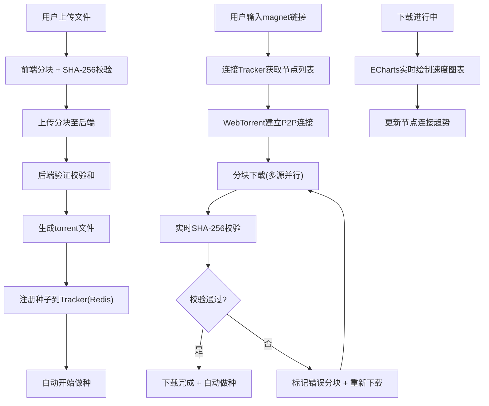

## 1. 产品概述

P2P文件分发平台，基于WebTorrent协议实现浏览器端点对点文件传输。用户上传文件后自动生成分块torrent种子，多个客户端可同时下载并互相上传数据，充分利用P2P带宽优势。
- 解决大文件分发场景下服务器带宽瓶颈问题，通过P2P方式降低中心化传输成本
- 面向需要高效文件分发的开发者和团队，提供可视化、可追踪的P2P传输体验

## 2. 核心功能

### 2.1 用户角色
| 角色 | 注册方式 | 核心权限 |
|------|----------|----------|
| 普通用户 | 无需注册 | 上传文件、下载文件、查看速度统计 |
| 种子节点 | 自动成为 | 上传文件后自动做种，为其他客户端提供数据 |

### 2.2 功能模块
1. **文件管理页**：文件上传（拖拽/点击）、文件列表、torrent文件下载、文件分块校验状态展示
2. **P2P下载页**：WebTorrent实时下载、下载进度条、P2P节点信息面板、做种状态展示
3. **数据统计页**：下载/上传速度实时折线图（ECharts）、历史速度统计、节点连接数趋势

### 2.3 页面详情
| 页面名称 | 模块名称 | 功能描述 |
|----------|----------|----------|
| 文件管理页 | 文件上传区 | 支持拖拽上传和点击选择文件，上传时自动分块计算SHA-256校验和 |
| 文件管理页 | 文件列表 | 展示已上传文件列表，显示文件名、大小、分块数、校验状态、种子数 |
| 文件管理页 | torrent下载 | 点击生成/下载.torrent文件，显示magnet链接可复制 |
| P2P下载页 | magnet输入区 | 输入magnet链接或上传.torrent文件开始下载 |
| P2P下载页 | 下载进度面板 | 显示下载进度条、下载/上传速度、已连接节点数、做种状态 |
| P2P下载页 | 分块校验面板 | 可视化展示各分块SHA-256校验状态（绿色通过/红色失败） |
| 数据统计页 | 实时速度图表 | ECharts实时折线图展示下载和上传速度 |
| 数据统计页 | 历史统计 | 总下载量、总上传量、平均速度、峰值速度等汇总信息 |
| 数据统计页 | 节点趋势图 | 连接节点数随时间变化趋势图 |

## 3. 核心流程

**文件上传流程**：用户选择文件 → 前端分块计算SHA-256 → 上传分块到后端 → 后端验证校验和 → 生成torrent文件 → 注册到Tracker → 自动开始做种

**P2P下载流程**：用户输入magnet链接 → 连接Tracker获取节点列表 → WebTorrent建立P2P连接 → 分块下载 → 实时校验SHA-256 → 下载完成 → 自动做种

## 4. 用户界面设计

### 4.1 设计风格
- 主色调：深蓝科技风（#0A1628 背景 + #00D4FF 霓虹蓝高亮 + #7C3AED 紫色辅助）
- 按钮：圆角（8px）、霓虹发光效果（box-shadow glow）
- 字体：JetBrains Mono（数据展示）+ Noto Sans SC（中文正文）
- 布局：左侧导航 + 右侧内容区，卡片式布局（毛玻璃效果）
- 图标风格：线性描边、霓虹色调

### 4.2 页面设计概览
| 页面名称 | 模块名称 | UI元素 |
|----------|----------|--------|
| 文件管理页 | 文件上传区 | 拖拽区域带虚线边框+脉冲动画，上传进度环形指示器 |
| 文件管理页 | 文件列表 | 毛玻璃卡片列表，悬停发光边框，校验状态LED指示灯 |
| P2P下载页 | 下载进度 | 渐变进度条+粒子动画，速度数字用等宽字体 |
| P2P下载页 | 分块校验 | 网格热力图，每个分块为一个方块，颜色表示状态 |
| 数据统计页 | 速度图表 | ECharts暗色主题折线图，渐变填充区域 |
| 数据统计页 | 统计卡片 | 毛玻璃统计卡片，数值用大号等宽字体 |

### 4.3 响应式
- 桌面优先设计，最小宽度1024px
- 平板适配：侧边导航折叠为汉堡菜单
- 移动端：堆叠布局，统计图表自适应宽度

### 4.4 3D场景指导
- 不适用
