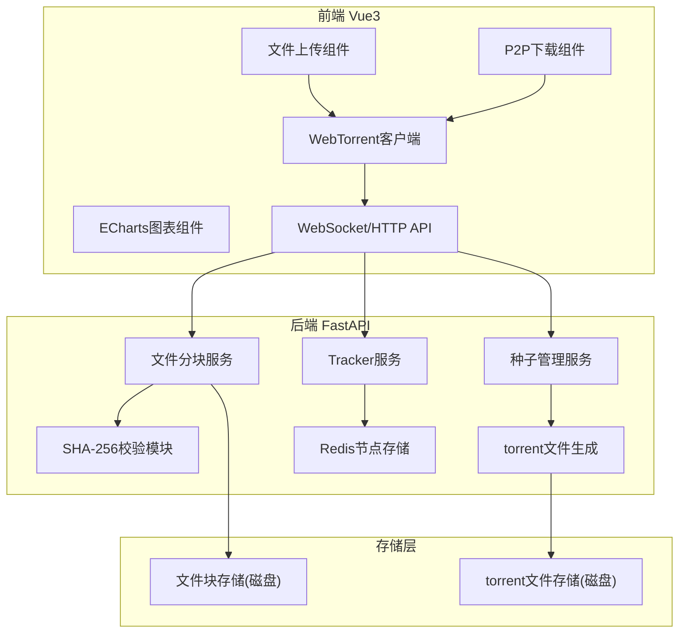
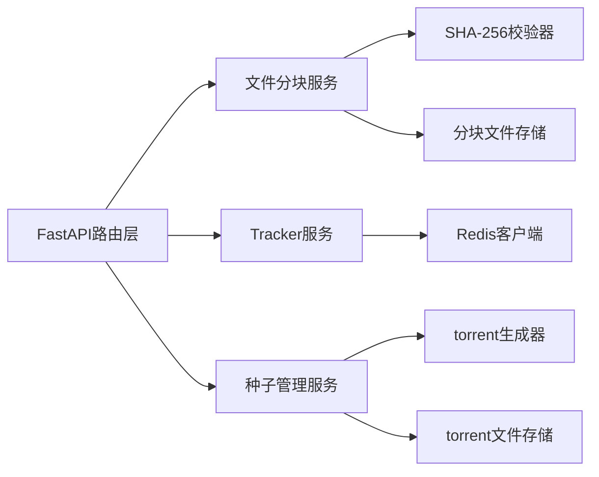
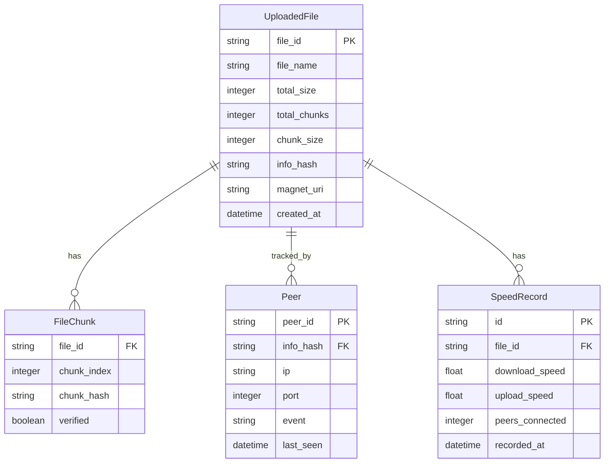

## 1. 架构设计



## 2. 技术说明
- 前端：Vue3 + TypeScript + Vite + Tailwind CSS + ECharts + WebTorrent
- 初始化工具：vite-init（vue-ts模板）
- 后端：FastAPI (Python 3.11+)
- 数据库：Redis（节点列表和Tracker数据存储）
- 文件存储：本地磁盘（分块文件和torrent文件）

## 3. 路由定义
| 路由 | 用途 |
|------|------|
| / | 文件管理页 - 文件上传、列表、torrent生成 |
| /download | P2P下载页 - magnet链接下载、进度展示 |
| /stats | 数据统计页 - 速度图表、节点趋势 |

## 4. API定义

### 4.1 文件上传
```typescript
POST /api/upload
Content-Type: multipart/form-data

Request: {
  file: File
  chunk_index: number
  chunk_hash: string
  total_chunks: number
  file_id: string
}

Response: {
  file_id: string
  chunk_index: number
  verified: boolean
}
```

### 4.2 完成上传
```typescript
POST /api/upload/complete

Request: {
  file_id: string
  file_name: string
  total_chunks: number
  total_size: number
  chunk_hashes: string[]
}

Response: {
  file_id: string
  torrent_url: string
  magnet_uri: string
  info_hash: string
}
```

### 4.3 获取文件列表
```typescript
GET /api/files

Response: {
  files: Array<{
    file_id: string
    file_name: string
    total_size: number
    total_chunks: number
    seeders: number
    leechers: number
    created_at: string
    magnet_uri: string
  }>
}
```

### 4.4 获取torrent文件
```typescript
GET /api/torrent/{file_id}

Response: .torrent文件(binary)
```

### 4.5 下载分块
```typescript
GET /api/chunk/{file_id}/{chunk_index}

Response: binary chunk data
```

### 4.6 Tracker - 宣告
```typescript
GET /tracker/announce?info_hash={hash}&peer_id={id}&ip={ip}&port={port}&event={started|completed|stopped}

Response: {
  interval: number
  peers: Array<{
    peer_id: string
    ip: string
    port: number
  }>
}
```

### 4.7 速度统计
```typescript
GET /api/stats/{file_id}

Response: {
  download_speed: number
  upload_speed: number
  peers_connected: number
  progress: number
  chunks_status: Array<{
    index: number
    verified: boolean
  }>
}
```

## 5. 服务端架构图



## 6. 数据模型

### 6.1 数据模型定义



### 6.2 Redis数据结构

```
# 节点列表 - 以info_hash为key
peers:{info_hash} -> Hash { peer_id: {ip, port, last_seen} }

# 文件元信息
file:{file_id} -> Hash { file_name, total_size, total_chunks, chunk_size, info_hash, magnet_uri, created_at }

# 分块校验
chunks:{file_id} -> Hash { chunk_index: chunk_hash }

# 速度记录 - 以file_id为key，使用Sorted Set按时间排序
speed:{file_id} -> Sorted Set { timestamp: {download_speed, upload_speed, peers_connected} }
```
