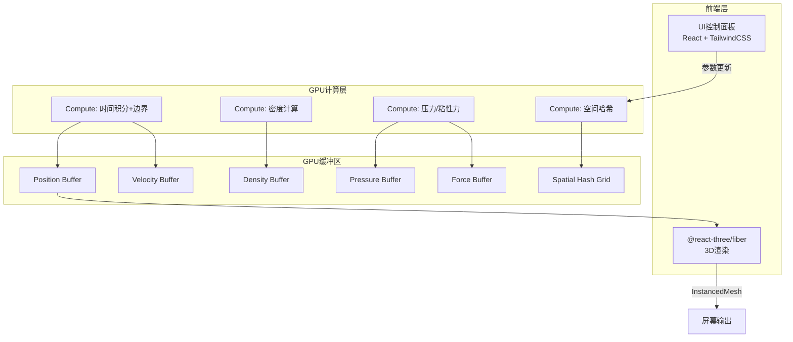

## 1. 架构设计

## 2. 技术说明

- **前端框架**：React@18 + TailwindCSS@3 + Vite
- **3D渲染**：Three.js (WebGPU Renderer) + @react-three/fiber + @react-three/drei
- **GPU计算**：Three.js WebGPU Compute Shader（通过`NodeMaterial`和`ComputeNode`）
- **后端**：无（纯前端应用）
- **数据库**：无

### SPH算法关键公式

**核函数（Poly6核）**：
$$W(r, h) = \frac{315}{64\pi h^9}(h^2 - r^2)^3$$

**密度计算**：
$$\rho_i = \sum_j m_j W(|\mathbf{r}_i - \mathbf{r}_j|, h)$$

**压力（Tait方程）**：
$$p_i = k(\rho_i - \rho_0)$$

**压力力（Spiky核梯度）**：
$$\mathbf{f}_i^{pressure} = -\sum_j m_j \frac{p_i + p_j}{2\rho_j} \nabla W(|\mathbf{r}_i - \mathbf{r}_j|, h)$$

**粘性力（Laplacian核）**：
$$\mathbf{f}_i^{viscosity} = \mu \sum_j m_j \frac{\mathbf{v}_j - \mathbf{v}_i}{\rho_j} \nabla^2 W(|\mathbf{r}_i - \mathbf{r}_j|, h)$$

## 3. 路由定义

| 路由 | 用途 |
|------|------|
| / | 主模拟页面，包含3D视口和控制面板 |

## 4. Compute Shader管线设计

### 4.1 缓冲区布局

| 缓冲区 | 类型 | 大小 | 用途 |
|--------|------|------|------|
| positions | StorageBuffer | N×vec4<f32> | 粒子位置(x,y,z) + 密度(w) |
| velocities | StorageBuffer | N×vec4<f32> | 粒子速度(x,y,z) + 压力(w) |
| forces | StorageBuffer | N×vec4<f32> | 粒子合力(x,y,z,w) |
| gridCells | StorageBuffer | N×u32 | 空间哈希网格 |
| gridCounts | StorageBuffer | M×u32 | 网格单元计数 |
| params | UniformBuffer | ~256 bytes | 模拟参数 |

### 4.2 Compute Pass执行顺序

1. **空间哈希构建**：将粒子分配到3D网格单元，构建邻居查找结构
2. **密度计算**：遍历邻居粒子，Poly6核计算密度
3. **力计算**：压力力(Spiky核) + 粘性力(Laplacian核) + 重力
4. **时间积分 + 边界**：半隐式欧拉积分速度和位置，边界碰撞反射

### 4.3 渲染管线

- 从GPU缓冲区读取位置数据
- InstancedMesh：1个球体几何体 × 100,000实例
- 每帧更新实例矩阵（位置）和实例颜色（速度/密度映射）
- 可选UnrealBloomPass后处理

## 5. 参数定义

| 参数 | 默认值 | 范围 | 说明 |
|------|--------|------|------|
| particleCount | 100000 | 10000-200000 | 粒子数量 |
| particleRadius | 0.02 | 0.005-0.1 | 粒子渲染半径 |
| smoothingRadius | 0.1 | 0.05-0.5 | SPH光滑核半径h |
| restDensity | 1000 | 100-5000 | 静止密度ρ₀ |
| stiffness | 500 | 10-5000 | 气体常数k |
| viscosity | 200 | 0-2000 | 粘度系数μ |
| gravity | -9.81 | -20~0 | 重力加速度 |
| timeStep | 0.001 | 0.0001-0.01 | 时间步长Δt |
| damping | 0.5 | 0-1 | 边界碰撞阻尼 |
| colorMode | velocity | velocity/density/pressure | 颜色映射模式 |
| boundarySize | 2.0 | 0.5-5.0 | 边界盒半尺寸 |

## 6. 性能策略

- **空间哈希**：3D网格划分加速邻居搜索，将O(N²)降为O(N·k)
- **双缓冲**：位置/速度使用双缓冲避免读写冲突
- **工作组大小**：compute shader使用256线程工作组
- **实例渲染**：InstancedMesh批量渲染避免draw call开销
- **参数热更新**：uniform buffer动态更新，无需重建pipeline
