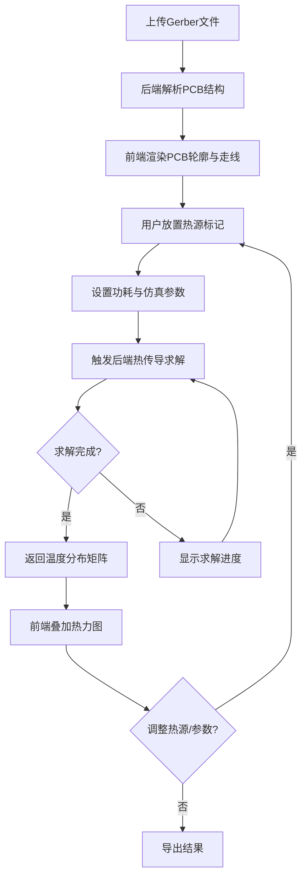

## 1. 产品概述

PCB热力仿真工具是一款面向电子工程师的在线电路板热分析应用。用户上传Gerber文件后，系统自动解析PCB走线与元件位置，基于有限差分法求解热传导方程，模拟不同功耗条件下的温度分布，并通过可交互的Canvas热力图实时可视化结果。

- 目标用户：电子工程师、PCB设计师、硬件研发团队
- 核心价值：在设计阶段快速定位热风险区域，避免因过热导致的失效，减少物理原型迭代次数

## 2. 核心功能

### 2.1 用户角色

| 角色 | 注册方式 | 核心权限 |
|------|----------|----------|
| 普通用户 | 无需注册 | 上传Gerber、放置热源、查看仿真结果 |

### 2.2 功能模块

1. **仿真工作台页面**：Gerber上传与解析、PCB渲染、热力图叠加、热源放置、参数调节、仿真计算

### 2.3 页面详情

| 页面名称 | 模块名称 | 功能描述 |
|----------|----------|----------|
| 仿真工作台 | Gerber文件上传区 | 拖拽/点击上传Gerber压缩包，解析走线层与元件位置 |
| 仿真工作台 | PCB Canvas视口 | 绘制PCB轮廓与走线，支持鼠标滚轮缩放与拖拽平移 |
| 仿真工作台 | 热力图叠加层 | 根据仿真温度数据渲染彩色热力图，颜色映射可调 |
| 仿真工作台 | 热源标记工具栏 | 选择热源类型（电阻/芯片/自定义），点击Canvas放置标记，设置功耗参数 |
| 仿真工作台 | 参数面板 | 设置环境温度、铜层厚度、板厚、对流系数等仿真参数 |
| 仿真工作台 | 仿真控制台 | 启动/暂停仿真，显示求解进度与迭代次数，一键重置 |
| 仿真工作台 | 温度信息浮窗 | 鼠标悬停显示当前坐标温度值与元件信息 |

## 3. 核心流程

用户上传Gerber文件 → 系统解析PCB结构（走线、焊盘、元件位置）→ Canvas渲染PCB轮廓与走线 → 用户放置热源标记并设置功耗 → 触发后端热传导方程求解 → 返回温度分布矩阵 → 前端叠加渲染热力图 → 用户可继续调整热源/参数并实时重新计算

## 4. 用户界面设计

### 4.1 设计风格

- **主色调**：深色工业风——深蓝灰(#0D1B2A)为背景，荧光青绿(#00F5D4)为主强调色，热力图采用经典jet色带（蓝→青→绿→黄→红）
- **按钮风格**：圆角微3D按钮，hover时轻微上浮并发出荧光辉光
- **字体**：JetBrains Mono作为数据/代码字体，Rajdhani作为标题字体，实现科技感
- **布局风格**：左侧工具面板 + 中央Canvas主视口 + 右侧参数面板，三栏布局
- **图标风格**：线性荧光图标，与深色背景形成强对比

### 4.2 页面设计概览

| 页面名称 | 模块名称 | UI元素 |
|----------|----------|--------|
| 仿真工作台 | 顶部工具栏 | 深色底栏，文件上传按钮、热源选择按钮组、仿真控制按钮 |
| 仿真工作台 | 左侧热源面板 | 可折叠面板，热源类型列表（芯片/电阻/电容），拖拽放置 |
| 仿真工作台 | 中央Canvas视口 | 占主区域，深色网格背景，PCB走线绿色/金色渲染，热力图半透明叠加 |
| 仿真工作台 | 右侧参数面板 | 滑块式参数输入，环境温度/板厚/对流系数，实时生效 |
| 仿真工作台 | 底部状态栏 | 求解状态、迭代次数、最大/最小温度、网格分辨率 |

### 4.3 响应式设计

- 桌面优先设计，三栏布局在1280px以上完整展示
- 1024px-1280px：左右面板可折叠为抽屉
- 1024px以下：面板变为底部/顶部标签切换

### 4.4 无3D场景
