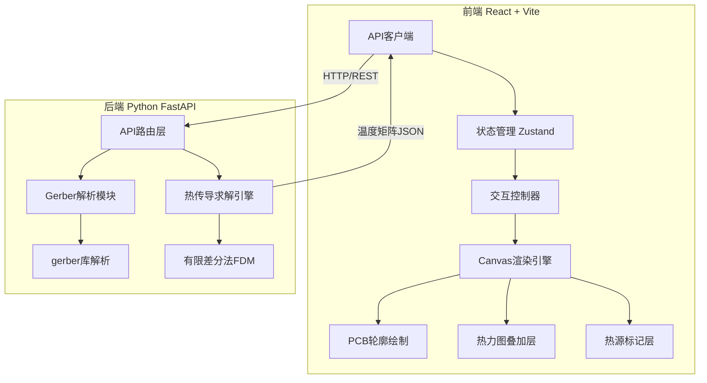
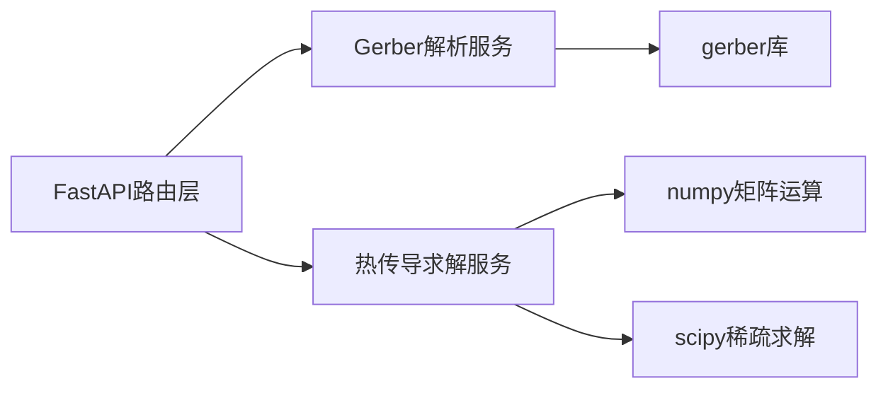

## 1. 架构设计



## 2. 技术说明

- **前端**：React@18 + Vite + TailwindCSS@3 + Zustand状态管理
- **初始化工具**：Vite
- **后端**：Python FastAPI + numpy（矩阵运算）+ scipy（稀疏矩阵求解）+ gerber（Gerber文件解析）
- **数据库**：无（纯计算服务，无需持久化）
- **通信**：REST API，JSON格式传输温度矩阵

## 3. 路由定义

| 路由 | 用途 |
|------|------|
| / | 仿真工作台主页面，包含所有功能模块 |

## 4. API定义

### 4.1 上传并解析Gerber

```typescript
interface GerberParseRequest {
  // multipart/form-data 上传文件
}

interface GerberParseResponse {
  board_id: string
  width: number       // mm
  height: number      // mm
  traces: TraceInfo[]
  pads: PadInfo[]
  components: ComponentInfo[]
  grid_resolution: { nx: number; ny: number }
}

interface TraceInfo {
  points: [number, number][]
  width: number        // mm
  layer: string        // "top" | "bottom" | "inner1" etc.
}

interface PadInfo {
  x: number            // mm
  y: number            // mm
  width: number        // mm
  height: number       // mm
  component_ref?: string
}

interface ComponentInfo {
  ref: string          // "R1", "U1" etc.
  x: number
  y: number
  width: number
  height: number
  layer: string
}
```

### 4.2 执行热仿真

```typescript
interface SimulationRequest {
  board_id: string
  heat_sources: HeatSource[]
  params: SimParams
}

interface HeatSource {
  id: string
  type: "resistor" | "ic_chip" | "custom"
  x: number            // mm
  y: number            // mm
  width: number        // mm
  height: number       // mm
  power: number        // W
}

interface SimParams {
  ambient_temp: number  // °C, default 25
  board_thickness: number // mm, default 1.6
  copper_thickness: number // oz, default 1
  convection_coeff: number // W/(m²·K), default 10
  max_iterations: number   // default 5000
  convergence: number      // °C, default 0.01
}

interface SimulationResponse {
  board_id: string
  temperature_matrix: number[][]  // 2D温度分布 °C
  max_temp: number
  min_temp: number
  iterations: number
  converged: boolean
  resolution: { nx: number; ny: number }
}
```

## 5. 服务器架构图



## 6. 数据模型

无持久化数据库，所有数据通过API在内存中传递。Gerber解析结果与仿真结果使用board_id在服务端内存缓存（LRU策略，最多保留20个板子数据）。

### 6.1 内存数据结构

```python
board_cache: Dict[str, BoardData] = {}

class BoardData:
    board_id: str
    traces: List[TraceInfo]
    pads: List[PadInfo]
    components: List[ComponentInfo]
    thermal_conductivity_matrix: np.ndarray  # 各网格点热导率
    width_mm: float
    height_mm: float
    created_at: datetime
```
