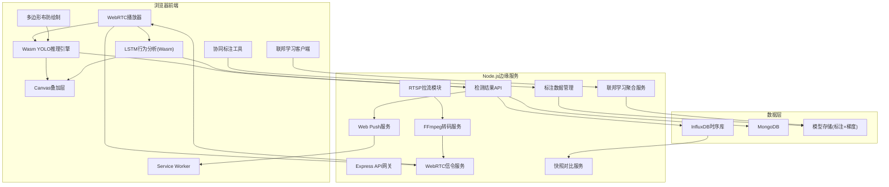
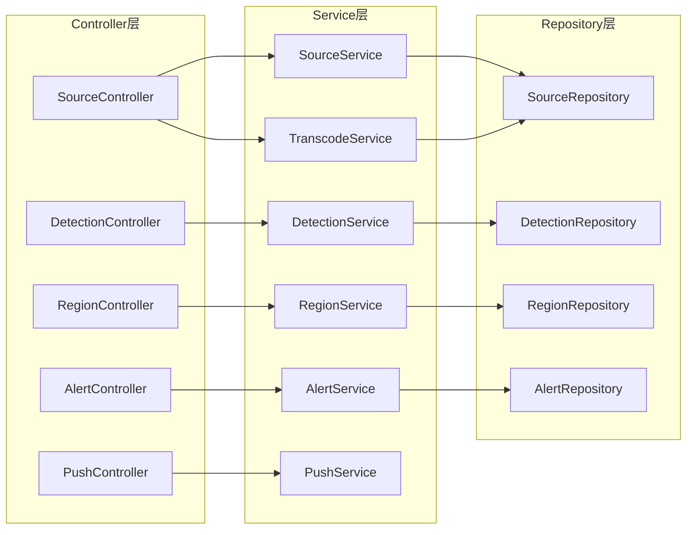
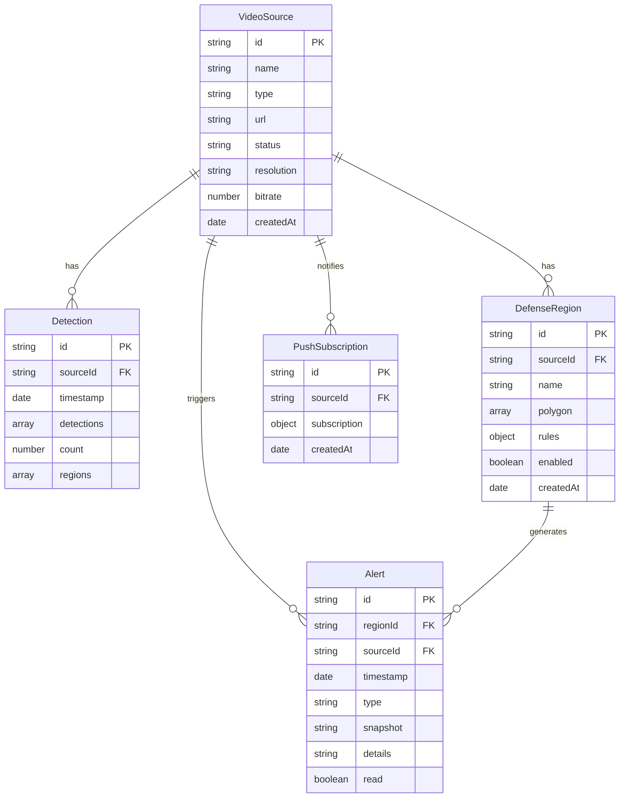

## 1. 架构设计



## 2. 技术说明

- 前端：React@18 + TailwindCSS@3 + Vite + TypeScript
- 初始化工具：Vite
- 后端：Express@4 + TypeScript
- 数据库：InfluxDB v2（时序数据库，存检测记录） + MongoDB（存视频源、布防规则、告警）
- 实时通信：WebSocket（信令） + WebRTC（视频流）
- 推理引擎：YOLOv8n ONNX → wasm SIMD + 多线程（SharedArrayBuffer）+ 分块处理
- 转码：FFmpeg（RTSP→WebRTC，内置5秒关键帧缓存）
- 通知：Web Push API（web-push库）
- 进程管理：Node.js worker_threads处理转码
- 重连策略：前端指数退避重连（最大1分钟），后端RTSP流断线自动重连

### 2.1 WASM推理优化

- **SIMD指令集**：onnxruntime-web SIMD版本，单指令多数据并行计算
- **多线程推理**：SharedArrayBuffer共享内存 + Web Workers池（最多4线程）
- **分块处理**：1080p帧切分为32×32宏块，流水线处理（预处理→推理→后处理）
- **帧间隔动态调整**：根据推理耗时自动跳帧，目标30fps
- **预估性能**：1080p从15fps提升至45fps+

### 2.2 RTSP可靠性增强

- **前端重连**：指数退避策略（1s→2s→4s→8s→16s→32s→60s，最大60秒）
- **后端缓存**：最近5秒关键帧缓存（LRU），重连后立即发送关键帧快速出图
- **心跳检测**：WebSocket每10秒ping/pong，超时30秒判定断线
- **流代理**：后端作为RTSP客户端代理，统一管理流生命周期

### 2.3 时序数据库升级

- **InfluxDB v2**：时序数据优化存储，检测结果写入InfluxDB
- **MongoDB**：保留非时序数据（视频源配置、布防规则、告警、标注数据）
- **热力图聚合**：InfluxDB flux查询高效时序聚合，毫秒级响应
- **数据保留**：检测数据30天自动过期，与原MongoDB TTL一致

### 2.4 行为分析（LSTM动作识别）

- **模型架构**：LSTM + 3D卷积（姿态估计→动作分类）
- **推理引擎**：ONNX Runtime Web (Wasm)，复用YOLO优化配置
- **动作分类**：追逐(chasing)、跌倒(fall)、徘徊(loitering)、奔跑(running)
- **时序窗口**：滑动窗口16帧，步长4帧，实时连续分析
- **姿态提取**：YOLO 17个人体关键点，归一化后输入LSTM
- **阈值触发**：置信度>0.7触发异常告警，推送Web Push

### 2.5 协同标注与联邦学习

- **协同标注**：多人同时暂停视频、绘制修正框、添加动作标签
- **实时同步**：WebSocket广播标注操作（draw/update/delete/commit）
- **冲突解决**：乐观锁+版本号，最后提交者需确认合并
- **联邦学习（FedAvg）**：
  - 客户端仅上传梯度（不上传原始标注数据）
  - 服务器聚合梯度（FedAvg算法：加权平均）
  - 周期性模型推送更新到所有客户端
- **隐私保护**：梯度差分隐私（ε=1.0，δ=1e-5），裁剪L2范数

### 2.6 快照对比模式

- **时间跨度**：前后24小时同一时间点（如今天10:00 vs 昨天10:00）
- **对比维度**：
  - 人流热力图叠加对比（半透明双色叠加）
  - 人流计数趋势图（双折线对比）
  - 异常事件列表对比
- **同步播放**：双视频画面同步播放/暂停/快进
- **差异高亮**：自动标记人流量差异>30%的时段

## 3. 路由定义

| 路由 | 用途 |
|------|------|
| `/` | 监控大屏（默认主页） |
| `/sources` | 视频源管理页面 |
| `/defense` | 区域布防与告警页面 |

## 4. API定义

### 4.1 视频源管理

```typescript
interface VideoSource {
  id: string;
  name: string;
  type: "file" | "rtsp";
  url?: string;
  status: "connecting" | "live" | "error" | "offline";
  resolution?: string;
  bitrate?: number;
  createdAt: Date;
}

// POST /api/sources/file - 上传视频文件
// multipart/form-data, field: video
// Response: VideoSource

// POST /api/sources/rtsp - 添加RTSP流
// Body: { name: string; url: string }
// Response: VideoSource

// GET /api/sources - 获取所有视频源
// Response: VideoSource[]

// DELETE /api/sources/:id - 删除视频源
// Response: { success: boolean }
```

### 4.2 WebRTC信令

```typescript
// WebSocket /ws/signaling
// 消息格式:
interface SignalingMessage {
  type: "offer" | "answer" | "ice-candidate";
  sourceId: string;
  sdp?: RTCSessionDescriptionInit;
  candidate?: RTCIceCandidateInit;
}
```

### 4.3 检测结果上报

```typescript
interface DetectionReport {
  sourceId: string;
  timestamp: Date;
  detections: Array<{
    bbox: [number, number, number, number]; // x, y, w, h (归一化)
    confidence: number;
    classId: number;
    label: string;
  }>;
  count: number;
  regions: Array<{
    regionId: string;
    insideCount: number;
    breached: boolean;
  }>;
}

// POST /api/detections - 上报检测结果
// Body: DetectionReport
// Response: { acknowledged: boolean }
```

### 4.4 热力图数据

```typescript
interface HeatmapData {
  sourceId: string;
  timeRange: { start: Date; end: Date };
  grid: number[][]; // 密度网格
  maxDensity: number;
}

// GET /api/heatmap/:sourceId?start=...&end=...&resolution=20
// Response: HeatmapData
```

### 4.5 布防区域

```typescript
interface DefenseRegion {
  id: string;
  sourceId: string;
  name: string;
  polygon: Array<{ x: number; y: number }>; // 归一化坐标
  rules: {
    maxPeople: number;
    direction: "in" | "out" | "both";
    schedule: { start: string; end: string }; // HH:mm
  };
  enabled: boolean;
  createdAt: Date;
}

// POST /api/regions - 创建布防区域
// Body: DefenseRegion (无id)
// Response: DefenseRegion

// PUT /api/regions/:id - 更新布防区域
// Body: Partial<DefenseRegion>
// Response: DefenseRegion

// DELETE /api/regions/:id - 删除布防区域
// Response: { success: boolean }

// GET /api/regions?sourceId=... - 获取布防区域列表
// Response: DefenseRegion[]
```

### 4.6 告警

```typescript
interface Alert {
  id: string;
  regionId: string;
  sourceId: string;
  timestamp: Date;
  type: "breach" | "overcrowd";
  snapshot: string; // base64截图
  details: string;
  read: boolean;
}

// GET /api/alerts?sourceId=...&unread=true
// Response: Alert[]

// PUT /api/alerts/:id/read - 标记已读
// Response: { success: boolean }

// POST /api/push/subscribe - 订阅Web Push
// Body: { subscription: PushSubscription, sourceId: string }
// Response: { success: boolean }
```

## 5. 服务架构图



## 6. 数据模型

### 6.1 数据模型定义



### 6.2 数据定义语言

```javascript
// MongoDB Collections

db.createCollection("video_sources");
db.video_sources.createIndex({ status: 1 });
db.video_sources.createIndex({ createdAt: -1 });

db.createCollection("detections");
db.detections.createIndex({ sourceId: 1, timestamp: -1 });
db.detections.createIndex({ timestamp: -1 });
// TTL索引：30天后自动清理
db.detections.createIndex({ timestamp: 1 }, { expireAfterSeconds: 2592000 });

db.createCollection("defense_regions");
db.defense_regions.createIndex({ sourceId: 1 });
db.defense_regions.createIndex({ enabled: 1 });

db.createCollection("alerts");
db.alerts.createIndex({ regionId: 1, timestamp: -1 });
db.alerts.createIndex({ sourceId: 1, read: 1 });
db.alerts.createIndex({ timestamp: -1 });

db.createCollection("push_subscriptions");
db.push_subscriptions.createIndex({ sourceId: 1 });
```
