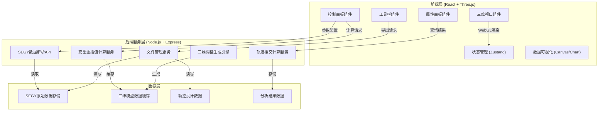
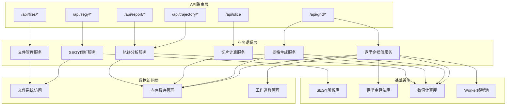
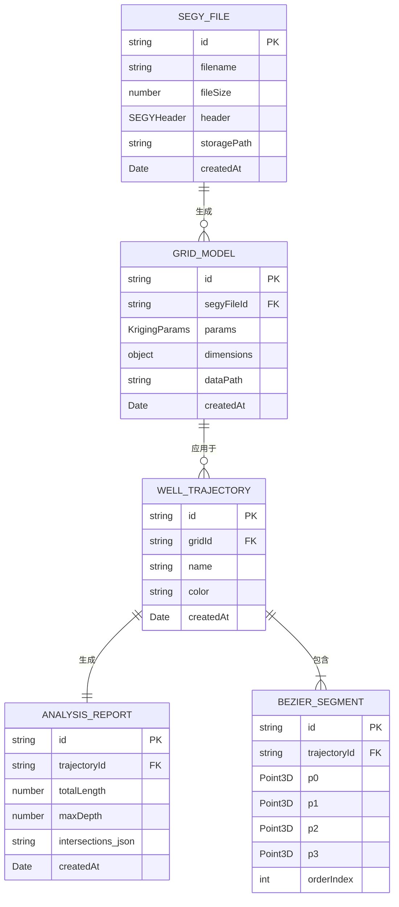

## 1. 架构设计



---

## 2. 技术描述

### 2.1 技术栈选型

| 层级 | 技术选型 | 版本 | 用途说明 |
|------|---------|------|---------|
| 前端框架 | React | 18.x | 用户界面组件化开发 |
| 前端语言 | TypeScript | 5.x | 类型安全开发 |
| 构建工具 | Vite | 5.x | 快速构建与热更新 |
| 3D引擎 | Three.js | 0.160.x | 三维场景渲染与交互 |
| 3D辅助 | @react-three/fiber | 8.x | React方式使用Three.js |
| 3D组件 | @react-three/drei | 9.x | 常用3D组件库 |
| 后处理 | @react-three/postprocessing | 2.x | 3D后处理效果 |
| 状态管理 | Zustand | 4.x | 全局状态管理 |
| UI样式 | TailwindCSS | 3.x | 原子化CSS样式 |
| 图表 | recharts | 2.x | 数据分析图表 |
| 图标 | lucide-react | 0.294.x | 图标组件库 |
| 后端框架 | Express | 4.x | API服务开发 |
| 后端语言 | TypeScript | 5.x | 后端类型安全 |
| 数值计算 | mathjs | 12.x | 矩阵与数值计算 |
| 数据处理 | @types/geotiff | 2.x | 地理数据处理辅助 |
| 序列化 | @msgpack/msgpack | 2.x | 三维数据高效传输 |

### 2.2 关键技术方案

**三维网格数据结构**：
- 采用200×200×100的三维规则网格，共4,000,000个体素
- 每个体素存储：地层编号、速度值、密度值、孔隙度
- 数据采用FlatArray存储优化，支持WebGL纹理上传

**克里金插值算法**：
- 实现普通克里金(Ordinary Kriging)插值
- 支持球状、指数、高斯三种变差函数模型
- 采用KD-tree优化邻域搜索，搜索半径可配置
- 支持并行计算加速插值过程

**任意角度切片算法**：
- 基于三维纹理的GPU切片渲染
- 支持平面方程定义任意切割平面
- 三线性插值确保切片图像质量
- 实时更新切片位置和法向

**三次贝塞尔轨迹设计**：
- 支持多段三次贝塞尔曲线拼接
- 控制点可拖拽编辑，实时更新轨迹
- 曲线采样精度可配置(默认1000点)
- 自动计算轨迹长度、曲率等参数

**轨迹-地层相交计算**：
- 射线追踪算法计算轨迹与地层交界面
- 二分法精确定位交点坐标
- 基于梯度计算地层倾角
- 累计计算各地层穿越厚度

---

## 3. 路由定义

| 路由路径 | 页面组件 | 用途说明 |
|---------|---------|----------|
| `/` | `MainWorkspace` | 主工作台，集成三维视口和所有控制面板 |
| `/data` | `DataManager` | SEGY数据管理与导入页面 |
| `/analysis` | `AnalysisReport` | 轨迹分析报告展示页面 |
| `/help` | `HelpDocs` | 系统帮助与使用说明 |

---

## 4. API定义

### 4.1 TypeScript类型定义

```typescript
// 三维点坐标
interface Point3D {
  x: number;
  y: number;
  z: number;
}

// 贝塞尔曲线控制点
interface BezierControlPoints {
  p0: Point3D;
  p1: Point3D;
  p2: Point3D;
  p3: Point3D;
}

// 钻井轨迹
interface WellTrajectory {
  id: string;
  name: string;
  segments: BezierControlPoints[];
  samplePoints: Point3D[];
  color: string;
}

//  SEGY数据头
interface SEGYHeader {
  sampleInterval: number;
  sampleCount: number;
  traceCount: number;
  formatCode: number;
}

// SEGY道数据
interface SEGYTrace {
  header: Record<string, number>;
  data: Float32Array;
}

// 三维网格数据
interface Grid3D {
  dimensions: { nx: number; ny: number; nz: number };
  origin: Point3D;
  spacing: Point3D;
  values: Float32Array;
  formationIds: Uint8Array;
}

// 克里金参数
interface KrigingParams {
  model: 'spherical' | 'exponential' | 'gaussian';
  range: number;
  sill: number;
  nugget: number;
  searchRadius: number;
  maxNeighbors: number;
}

// 地层信息
interface Formation {
  id: number;
  name: string;
  color: string;
  minValue: number;
  maxValue: number;
}

// 切片参数
interface SliceParams {
  normal: Point3D;
  origin: Point3D;
  showGrid: boolean;
  showContours: boolean;
}

// 相交分析结果
interface IntersectionResult {
  formationId: number;
  formationName: string;
  entryPoint: Point3D;
  exitPoint: Point3D;
  thickness: number;
  dipAngle: number;
  strikeAngle: number;
  entryDepth: number;
  exitDepth: number;
}

// 分析报告
interface AnalysisReport {
  trajectoryId: string;
  totalLength: number;
  maxDepth: number;
  intersections: IntersectionResult[];
  createdAt: Date;
}
```

### 4.2 REST API接口

| 方法 | 路径 | 请求参数 | 响应 | 说明 |
|------|------|---------|------|------|
| POST | `/api/segy/upload` | `multipart/form-data` 文件 | `{ fileId: string; header: SEGYHeader; preview: number[][] }` | 上传SEGY文件 |
| GET | `/api/segy/:fileId` | - | `{ header: SEGYHeader; traces: SEGYTrace[] }` | 获取SEGY数据 |
| DELETE | `/api/segy/:fileId` | - | `{ success: boolean }` | 删除SEGY文件 |
| POST | `/api/grid/kriging` | `{ fileId: string; params: KrigingParams; dimensions: {nx, ny, nz} }` | `{ gridId: string; progress: number }` | 启动克里金插值 |
| GET | `/api/grid/:gridId/progress` | - | `{ progress: number; status: string }` | 查询插值进度 |
| GET | `/api/grid/:gridId` | - | `Grid3D` | 获取三维网格数据 |
| POST | `/api/slice` | `{ gridId: string; params: SliceParams }` | `{ imageData: Uint8Array; width: number; height: number }` | 生成切片图像 |
| POST | `/api/trajectory/analyze` | `{ gridId: string; trajectory: WellTrajectory }` | `AnalysisReport` | 分析轨迹相交 |
| GET | `/api/trajectory/:trajectoryId` | - | `WellTrajectory` | 获取轨迹数据 |
| POST | `/api/trajectory` | `WellTrajectory` | `{ id: string }` | 保存轨迹设计 |
| GET | `/api/report/:reportId` | - | `AnalysisReport` | 获取分析报告 |
| GET | `/api/files/list` | - | `{ segyFiles: string[]; grids: string[]; trajectories: string[] }` | 列出所有数据文件 |

---

## 5. 服务器架构图



---

## 6. 数据模型

### 6.1 数据模型关系图



### 6.2 数据存储结构

```
data/
├── segy/
│   ├── {fileId}.segy          # 原始SEGY文件
│   └── {fileId}_meta.json     # 文件元数据
├── grid/
│   ├── {gridId}_values.bin    # 网格数值数据 (Float32Array)
│   ├── {gridId}_formation.bin # 地层编号数据 (Uint8Array)
│   └── {gridId}_meta.json     # 网格元数据
├── trajectory/
│   └── {trajectoryId}.json    # 轨迹设计数据
└── report/
    └── {reportId}.json        # 分析报告数据
```

### 6.3 关键数据结构说明

**三维网格数据文件格式**：
- `_values.bin`: 二进制文件，按x-y-z顺序存储Float32数值，共nx*ny*nz个元素
- `_formation.bin`: 二进制文件，按相同顺序存储Uint8地层编号
- `_meta.json`: JSON格式元数据，包含维度、原点、间距、地层信息等

**传输优化**：
- 三维数据采用MessagePack序列化后传输
- 支持分块请求，按需加载数据
- 浏览器端IndexedDB缓存已加载数据
---
