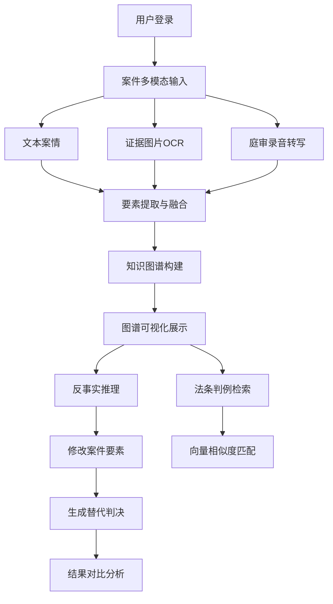

## 1. 产品概述

多模态知识图谱驱动的反事实推理法律辅助系统，旨在通过人工智能技术为法律从业者提供智能化的案件分析和判决预测服务。系统整合多模态数据输入、知识图谱构建、反事实推理等核心技术，帮助律师、法官和法学研究者快速理解案件关联关系，探索不同事实假设下的判决结果。

- 核心目标：构建智能化法律分析平台，提升法律工作效率和判决预测准确性
- 目标用户：律师、法官、检察官、法学研究者、企业法务人员
- 市场价值：填补国内法律AI领域在反事实推理和多模态知识图谱结合的空白

## 2. 核心功能

### 2.1 用户角色

| 角色 | 注册方式 | 核心权限 |
|------|----------|----------|
| 普通用户 | 手机号/邮箱注册 | 案件输入、图谱浏览、基础反事实推理 |
| 专业用户 | 资质认证 | 全部功能、批量案件处理、数据导出 |
| 管理员 | 后台账号 | 系统管理、数据维护、用户审核 |

### 2.2 功能模块

1. **案件多模态输入页面**：文本案情输入、证据图片OCR识别、庭审录音转文字
2. **知识图谱可视化页面**：交互式图谱展示、节点拖拽、路径高亮、实体详情
3. **反事实推理页面**：关键要素修改、替代判决生成、推理路径展示、结果对比
4. **法条判例检索页面**：基于向量相似度的法条和判例检索
5. **案件管理页面**：历史案件列表、案件详情、案件对比

### 2.3 页面详情

| 页面名称 | 模块名称 | 功能描述 |
|---------|---------|----------|
| 案件多模态输入 | 文本输入模块 | 支持富文本案情描述，自动提取关键要素 |
| 案件多模态输入 | 图片OCR模块 | 支持证据图片上传，自动识别文字内容并提取要素 |
| 案件多模态输入 | 音频转写模块 | 支持庭审录音上传，自动转写为文字并分段标注 |
| 知识图谱可视化 | 图谱渲染模块 | 使用D3.js/Vis.js渲染交互式知识图谱，支持缩放平移 |
| 知识图谱可视化 | 节点交互模块 | 支持节点拖拽、点击查看详情、悬停显示信息 |
| 知识图谱可视化 | 路径分析模块 | 支持两点间路径查找、关键路径高亮显示 |
| 反事实推理 | 要素编辑模块 | 可视化修改案件关键要素（金额、情节、主体等） |
| 反事实推理 | 推理引擎模块 | 基于修改后的要素生成替代判决结果 |
| 反事实推理 | 结果对比模块 | 并排展示原判决和替代判决，高亮差异点 |
| 法条判例检索 | 向量检索模块 | 基于语义相似度检索相关法条和判例 |
| 法条判例检索 | 结果展示模块 | 分页展示检索结果，支持筛选和排序 |

## 3. 核心流程

用户首先在案件输入页面提交多模态数据（文本、图片、音频），系统自动处理并提取案件要素，构建知识图谱。用户可以在图谱可视化页面浏览实体关系，理解案件脉络。在反事实推理页面，用户可以修改关键要素（如涉案金额、情节严重程度等），系统基于修改后的要素重新推理，生成替代判决结果，并展示推理路径。用户还可以通过法条判例检索功能查找相关法律依据。

## 4. 用户界面设计

### 4.1 设计风格

- **主色调**：深蓝色系（#1e3a8a），代表专业、严谨、权威
- **辅助色**：金色（#d4af37）用于强调和高亮，浅灰蓝色（#e0e7ff）用于背景
- **按钮风格**：圆角矩形按钮，悬停有阴影和颜色加深效果，点击有按压反馈
- **字体**：标题使用"Noto Serif SC"衬线字体体现法律文书的正式感，正文使用"Noto Sans SC"无衬线字体保证可读性
- **布局风格**：左侧导航栏+右侧主内容区的经典后台布局，卡片式模块划分
- **图标风格**：使用线性图标，保持简洁专业，避免过度装饰

### 4.2 页面设计概述

| 页面名称 | 模块名称 | UI元素 |
|---------|---------|--------|
| 案件多模态输入 | 顶部导航 | Logo、用户信息、全局搜索、主题切换 |
| 案件多模态输入 | 左侧菜单 | 案件输入、图谱可视化、反事实推理、法条检索、案件管理 |
| 案件多模态输入 | 主内容区 | 三栏布局：文本输入区、图片上传区、音频上传区 |
| 知识图谱可视化 | 图谱画布 | 全屏可交互画布，节点拖拽，滚轮缩放 |
| 知识图谱可视化 | 侧边面板 | 实体详情、关系列表、图例说明 |
| 知识图谱可视化 | 工具栏 | 缩放控制、布局切换、搜索筛选、导出 |
| 反事实推理 | 要素编辑区 | 可编辑的要素卡片，滑块/下拉框修改数值 |
| 反事实推理 | 结果对比区 | 左右双栏对比布局，差异点高亮标记 |
| 反事实推理 | 推理路径 | 树状图展示推理链条，关键节点标注 |

### 4.3 响应式设计

- 桌面端（1200px+）：完整侧边栏+多栏布局，图谱画布最大化
- 平板端（768px-1199px）：侧边栏可折叠，图谱自适应宽度
- 移动端（<768px）：底部导航栏，单栏滚动布局，图谱简化展示

### 4.4 交互动效

- 页面加载：元素淡入+上移动画，延迟0.1s依次出现
- 节点悬停：放大1.1倍，显示光晕效果，关系线加粗
- 面板切换：平滑过渡动画，0.3s ease-in-out
- 按钮点击：缩放0.95倍后回弹，配合轻微阴影变化
- 数据加载：骨架屏+脉冲动画，避免空白页面
