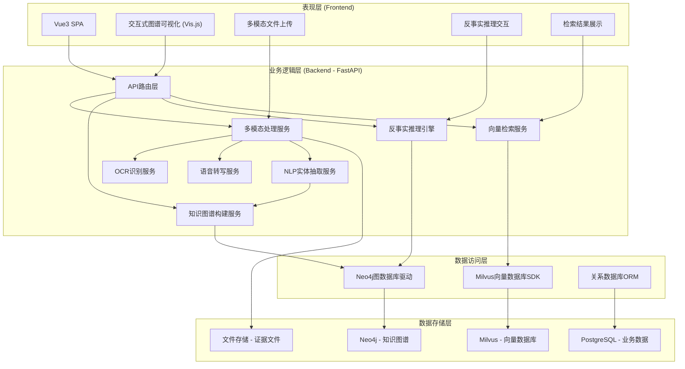
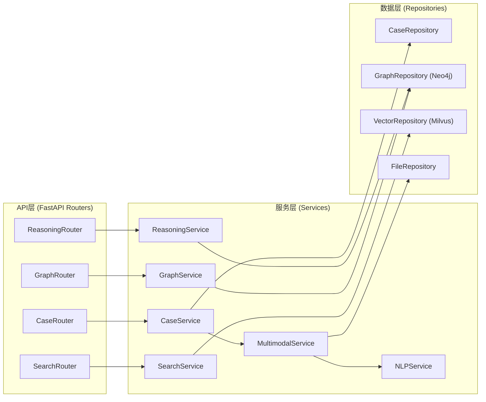
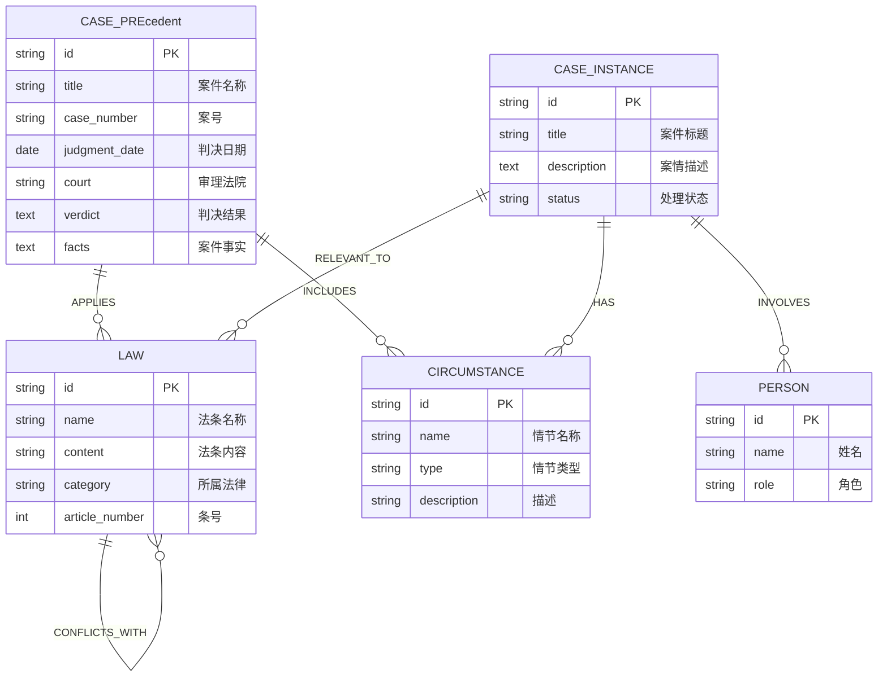

## 1. 架构设计

系统采用前后端分离的四层架构设计，包括表现层、业务逻辑层、数据访问层和数据存储层。前端使用Vue3构建交互式界面，后端使用FastAPI提供RESTful API服务，图数据库Neo4j存储法律知识图谱，向量数据库Milvus存储法条和判例的向量表示以支持语义检索。



## 2. 技术描述

### 2.1 前端技术栈
- **框架**: Vue 3.4 + TypeScript 5.4
- **构建工具**: Vite 5.2
- **路由**: Vue Router 4.3
- **状态管理**: Pinia 2.1
- **UI组件库**: Element Plus 2.7
- **图谱可视化**: Vis.js 4.21
- **HTTP客户端**: Axios 1.7
- **样式**: Tailwind CSS 3.4
- **图标**: Lucide Vue Next

### 2.2 后端技术栈
- **框架**: FastAPI 0.111
- **Python**: 3.11
- **异步处理**: asyncio + aiofiles
- **OCR**: PaddleOCR 2.7
- **语音转写**: OpenAI Whisper / 本地ASR
- **NLP**: jieba + Transformers (BERT)
- **向量模型**: text2vec-base-chinese
- **图数据库驱动**: neo4j 5.20

### 2.3 数据库
- **图数据库**: Neo4j 5.19 Community
- **向量数据库**: Milvus 2.4
- **关系数据库**: PostgreSQL 16
- **文件存储**: 本地文件系统 / MinIO

## 3. 前端路由定义

| 路由路径 | 页面名称 | 功能描述 |
|---------|---------|----------|
| / | 首页/仪表盘 | 系统概览、快捷功能入口 |
| /case/input | 案件多模态输入 | 文本、图片、音频输入与处理 |
| /case/list | 案件管理 | 历史案件列表、案件详情 |
| /graph/visualization | 知识图谱可视化 | 交互式图谱展示与分析 |
| /reasoning/counterfactual | 反事实推理 | 要素修改与替代判决生成 |
| /search/legal | 法条判例检索 | 语义检索相关法条和判例 |
| /settings | 系统设置 | 用户设置、偏好配置 |

## 4. API 定义

### 4.1 类型定义

```typescript
// 案件实体
interface Case {
  id: string;
  title: string;
  description: string;
  caseType: 'civil' | 'criminal' | 'administrative';
  status: 'processing' | 'completed';
  createdAt: Date;
  elements: CaseElement[];
}

// 案件要素
interface CaseElement {
  id: string;
  name: string;
  type: 'person' | 'amount' | 'action' | 'circumstance';
  value: any;
  editable: boolean;
}

// 知识图谱实体
interface GraphEntity {
  id: string;
  label: string;
  type: 'law' | 'case' | 'element' | 'circumstance';
  properties: Record<string, any>;
}

// 知识图谱关系
interface GraphRelation {
  id: string;
  source: string;
  target: string;
  type: 'APPLIES' | 'CONFLICTS' | 'EXCEPTION' | 'REFERENCES';
  properties: Record<string, any>;
}

// 反事实推理请求
interface CounterfactualRequest {
  caseId: string;
  modifiedElements: Array<{ elementId: string; newValue: any }>;
}

// 推理结果
interface ReasoningResult {
  originalVerdict: string;
  alternativeVerdict: string;
  reasoningPath: ReasoningStep[];
  confidence: number;
  differences: DifferenceItem[];
}
```

### 4.2 API 接口列表

| 方法 | 路径 | 描述 | 请求体 | 响应 |
|------|------|------|--------|------|
| POST | `/api/cases` | 创建新案件 | `{ title, description, caseType }` | `Case` |
| POST | `/api/cases/:id/upload-text` | 上传案件文本 | `{ content }` | `{ elements: CaseElement[] }` |
| POST | `/api/cases/:id/upload-image` | 上传证据图片 | `FormData (file)` | `{ ocrText: string, elements: CaseElement[] }` |
| POST | `/api/cases/:id/upload-audio` | 上传庭审录音 | `FormData (file)` | `{ transcript: string, elements: CaseElement[] }` |
| GET | `/api/cases/:id/graph` | 获取案件知识图谱 | - | `{ nodes: GraphEntity[], edges: GraphRelation[] }` |
| POST | `/api/reasoning/counterfactual` | 执行反事实推理 | `CounterfactualRequest` | `ReasoningResult` |
| POST | `/api/search/legal` | 法条判例检索 | `{ query, type, limit }` | `{ results: Array<{ id, title, content, similarity }> }` |
| GET | `/api/graph/entities` | 获取图谱实体列表 | `{ type, page, pageSize }` | `{ items: GraphEntity[], total }` |

## 5. 后端服务架构



### 5.1 目录结构

```
backend/
├── app/
│   ├── main.py              # FastAPI应用入口
│   ├── api/
│   │   ├── __init__.py
│   │   ├── v1/
│   │   │   ├── case.py      # 案件相关路由
│   │   │   ├── graph.py     # 图谱相关路由
│   │   │   ├── reasoning.py # 推理相关路由
│   │   │   └── search.py    # 检索相关路由
│   ├── services/            # 业务逻辑层
│   │   ├── case_service.py
│   │   ├── multimodal_service.py
│   │   ├── graph_service.py
│   │   ├── reasoning_service.py
│   │   ├── nlp_service.py
│   │   └── search_service.py
│   ├── repositories/        # 数据访问层
│   │   ├── case_repository.py
│   │   ├── graph_repository.py
│   │   ├── vector_repository.py
│   │   └── file_repository.py
│   ├── models/              # 数据模型
│   │   ├── schemas/         # Pydantic模型
│   │   └── database.py      # ORM模型
│   ├── config/              # 配置模块
│   │   └── settings.py
│   └── utils/               # 工具函数
├── data/
│   └── init/                # 初始化数据
│       ├── criminal_law.py  # 刑法数据
│       ├── civil_code.py    # 民法典数据
│       └── cases.py         # 判例数据
├── requirements.txt
└── docker-compose.yml       # 多容器部署
```

## 6. 数据模型

### 6.1 图数据库模型 (Neo4j)



### 6.2 Milvus 集合定义

| 集合名称 | 字段 | 类型 | 维度 | 索引类型 | 描述 |
|---------|------|------|------|----------|------|
| law_vectors | id | INT64 | - | - | 法条ID |
| | vector | FLOAT_VECTOR | 768 | IVF_FLAT | 法条内容向量 |
| | category | VARCHAR | - | - | 法律类别 |
| case_vectors | id | INT64 | - | - | 判例ID |
| | vector | FLOAT_VECTOR | 768 | IVF_FLAT | 判例内容向量 |
| | court | VARCHAR | - | - | 审理法院 |
| | case_type | VARCHAR | - | - | 案件类型 |

### 6.3 初始化数据方案

- **刑法数据**: 提取《中华人民共和国刑法》全部452个法条，每个法条作为独立实体
- **民法典数据**: 提取《中华人民共和国民法典》核心500个法条（物权编、合同编、侵权责任编等）
- **实体类型统计**: 
  - 法条实体: 952+ 个
  - 情节实体: 50+ 个（如"自首"、"立功"、"未遂"、"累犯"等）
  - 判例实体: 50+ 个指导案例
  - 总计: 1052+ 个实体，满足500+实体要求
- **关系数据**: 构建法条间的"适用"、"冲突"、"例外"关系，判例与法条的"引用"关系
