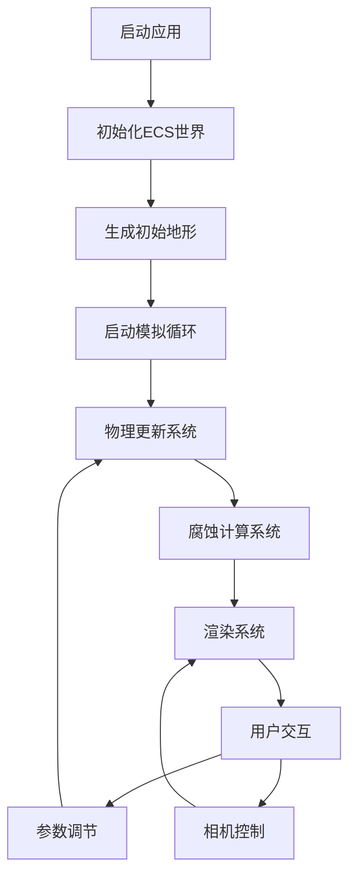

## 1. 产品概述

基于ECS架构的粒子流体动力学实时腐蚀模拟器，用于模拟水流对地形的实时腐蚀效果。面向计算机图形学研究者、游戏开发者和教育工作者，提供高性能、可交互的流体腐蚀可视化工具。

- 核心功能：ECS架构管理的SPH流体模拟 + 地形腐蚀三阶段模型
- 技术价值：展示数据驱动架构在实时物理模拟中的应用

## 2. 核心功能

### 2.1 用户角色

| 角色 | 登录方式 | 核心权限 |
|------|----------|----------|
| 普通用户 | 无需登录 | 使用所有模拟功能、调节参数、观察效果 |

### 2.2 功能模块

1. **主模拟页面**：3D场景渲染、流体粒子模拟、地形腐蚀展示
2. **参数控制面板**：粒子参数调节、腐蚀参数调节、相机控制
3. **性能监控面板**：FPS显示、粒子数量统计、系统负载监控

### 2.3 页面详情

| 页面名称 | 模块名称 | 功能描述 |
|----------|----------|----------|
| 主模拟页面 | 3D场景 | 实时渲染流体粒子和地形，支持相机漫游 |
| 主模拟页面 | ECS系统 | 物理更新系统、腐蚀计算系统、渲染系统 |
| 参数控制面板 | 粒子参数 | 粒子发射率、初始速度、粒子质量、粘度系数 |
| 参数控制面板 | 腐蚀参数 | 溶蚀强度、搬运系数、沉积阈值 |
| 性能监控面板 | 统计信息 | FPS、粒子数量、地形更新频率 |

## 3. 核心流程

用户打开应用后，自动初始化ECS世界、生成地形、开始流体粒子发射。用户可通过鼠标控制相机视角，通过ImGui面板调节参数，实时观察腐蚀效果变化。

## 4. 用户界面设计

### 4.1 设计风格
- 主色调：深蓝科技风 (#0a192f) + 亮蓝强调色 (#64ffda)
- 背景：深色渐变 + 轻微噪点纹理
- 面板风格：半透明玻璃态，圆角边框，柔和阴影
- 字体：JetBrains Mono (等宽代码字体) + Orbitron (标题科技字体)
- 图标：简洁线性图标，科技感几何图形

### 4.2 页面设计概述

| 页面名称 | 模块名称 | UI元素 |
|----------|----------|---------|
| 主模拟页面 | 3D场景 | 深色背景、粒子发光效果、地形高度着色、实时阴影 |
| 主模拟页面 | 参数面板 | 浮动面板、滑动条、数值输入框、重置按钮 |
| 主模拟页面 | 性能面板 | 右上角浮动、实时图表、数字显示 |

### 4.3 响应性
- 桌面端优先：1920×1080分辨率优化
- 自适应布局：面板可拖拽、可折叠
- 鼠标交互：左键旋转视角、中键平移、滚轮缩放

### 4.4 3D场景指导
- **环境**：深色空间感背景，轻微雾效增强深度
- **光照**：主方向光 + 环境光，粒子自发光效果
- **相机**：透视相机，初始距离适中，支持OrbitControls
- **材质**：粒子使用PointsMaterial，地形使用MeshStandardMaterial
- **后处理**：Bloom效果增强粒子发光，FXAA抗锯齿
- **性能优化**：实例化渲染、LOD、视锥体剔除
