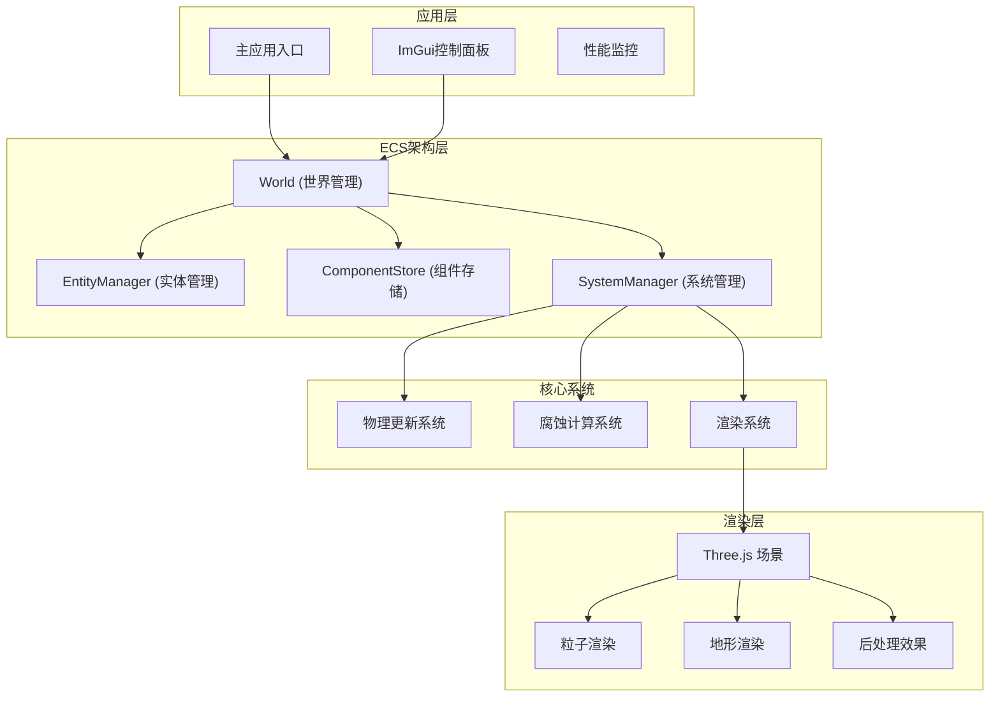

## 1. 架构设计



## 2. 技术描述

- **前端框架**：React@18 + TypeScript + Vite
- **3D渲染**：Three.js + @react-three/fiber + @react-three/drei
- **UI框架**：TailwindCSS@3
- **GUI面板**：lil-gui (轻量级ImGui替代品)
- **状态管理**：Zustand (轻量级状态管理)
- **性能优化**：
  - TypedArray存储粒子数据
  - WebGL实例化渲染
  - 空间网格加速SPH计算
  - RequestAnimationFrame帧率控制

## 3. 目录结构

| 路径 | 用途 |
|------|------|
| `/src` | 源代码根目录 |
| `/src/ecs` | ECS架构核心实现 |
| `/src/systems` | 各系统实现（物理、腐蚀、渲染） |
| `/src/components` | 组件类型定义 |
| `/src/render` | Three.js渲染相关 |
| `/src/ui` | UI组件和控制面板 |
| `/src/utils` | 工具函数和数学库 |
| `/src/types` | TypeScript类型定义 |

## 4. ECS架构设计

### 4.1 实体类型

| 实体ID | 组件组合 | 描述 |
|--------|----------|------|
| Particle | Position + Velocity + Mass + ChemicalConcentration | 流体粒子 |
| TerrainBlock | Position + Height + ErosionLevel | 地形块 |

### 4.2 组件定义

```typescript
interface Position { x: number; y: number; z: number; }
interface Velocity { vx: number; vy: number; vz: number; }
interface Mass { value: number; }
interface ChemicalConcentration { value: number; }
interface Height { value: number; normal: Vector3; }
interface ErosionLevel { value: number; sediment: number; }
```

### 4.3 系统实现

| 系统名称 | 执行频率 | 职责 |
|----------|----------|------|
| PhysicsSystem | 每帧 | SPH流体计算、粒子运动更新 |
| ErosionSystem | 每帧 | 溶蚀、搬运、沉积计算 |
| RenderSystem | 每帧 | 更新粒子位置、更新地形高度图 |

## 5. SPH流体模拟核心算法

### 5.1 核心参数
- 粒子上限：5000
- 平滑核半径：0.15
- 静止密度：1000
- 粘度系数：0.01
- 时间步长：0.016

### 5.2 计算流程
1. 密度计算：使用Poly6核函数
2. 压力计算：使用理想气体状态方程
3. 粘性力计算：使用Viscosity核函数
4. 位置更新：半隐式欧拉积分

## 6. 腐蚀模型

### 6.1 三阶段模型
1. **溶蚀阶段**：水流接触地形，溶解物质
2. **搬运阶段**：粒子携带溶解物质移动
3. **沉积阶段**：粒子减速，物质沉积

### 6.2 可配置参数
| 参数名称 | 范围 | 默认值 |
|----------|------|--------|
| 溶蚀强度 | 0.0 - 1.0 | 0.3 |
| 搬运系数 | 0.0 - 1.0 | 0.6 |
| 沉积阈值 | 0.0 - 1.0 | 0.2 |
| 粒子发射率 | 0 - 100 | 30 |
