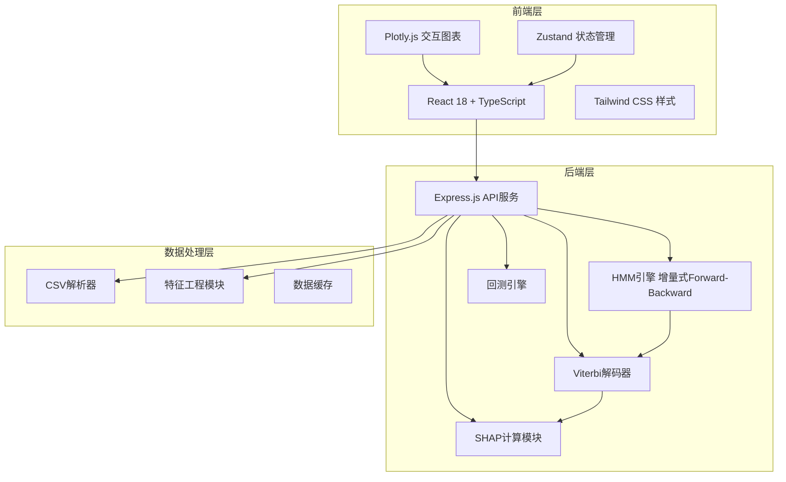

## 1. 架构设计



## 2. 技术说明

- 前端：React@18 + TypeScript + Tailwind CSS@3 + Vite
- 初始化工具：vite-init
- 后端：Express@4 + TypeScript（ESM格式）
- 状态管理：Zustand
- 图表库：Plotly.js（plotly.js-dist-min）
- 数据库：无，使用内存缓存 + 文件系统临时存储
- HMM/SHAP算法：纯TypeScript实现，无需Python依赖

## 3. 路由定义

| 路由 | 用途 |
|------|------|
| / | 首页仪表盘，概览入口 |
| /data | 数据管理，上传/预览/特征工程 |
| /detection | 模型训练与异常检测 |
| /rootcause | 根因分析（SHAP） |
| /backtest | 回测验证 |

## 4. API定义

### 4.1 数据管理API

```
POST   /api/data/upload          上传CSV文件
GET    /api/data/sample/:type    获取示例数据（stock/forex）
GET    /api/data/preview/:id     数据预览
POST   /api/data/features        计算衍生特征
```

### 4.2 HMM训练与检测API

```
POST   /api/hmm/train            增量式HMM训练
POST   /api/hmm/incremental      增量更新（新数据）
POST   /api/hmm/detect           异常检测（Viterbi解码）
GET    /api/hmm/status/:id       训练状态查询
```

### 4.3 根因分析API

```
POST   /api/shap/compute         计算SHAP值
GET    /api/shap/result/:id      获取SHAP结果
```

### 4.4 回测API

```
POST   /api/backtest/run         执行滑动窗口回测
GET    /api/backtest/result/:id  获取回测结果
```

### 4.5 TypeScript类型定义

```typescript
interface TimeSeriesData {
  id: string;
  name: string;
  dates: string[];
  features: Record<string, number[]>;
  length: number;
}

interface HMMConfig {
  nStates: number;
  learningRate: number;
  anomalyThreshold: number;
  maxIterations: number;
  convergenceTolerance: number;
}

interface HMMModel {
  id: string;
  pi: number[];
  A: number[][];
  mu: number[][];
  sigma: number[][][];
  trainedAt: string;
  dataLength: number;
}

interface AnomalyResult {
  timestamps: string[];
  logLikelihoods: number[];
  anomalyScores: number[];
  anomalies: boolean[];
  states: number[];
  threshold: number;
}

interface SHAPResult {
  featureNames: string[];
  shapValues: Record<string, number[]>;
  baseValue: number;
  anomalyIntervals: { start: number; end: number }[];
}

interface BacktestConfig {
  windowSize: number;
  stepSize: number;
  trainRatio: number;
  hmmConfig: HMMConfig;
}

interface BacktestResult {
  windows: {
    windowIndex: number;
    trainStart: number;
    trainEnd: number;
    testStart: number;
    testEnd: number;
    accuracy: number;
    precision: number;
    recall: number;
    f1: number;
    falseAlarmRate: number;
  }[];
  overallMetrics: {
    avgAccuracy: number;
    avgPrecision: number;
    avgRecall: number;
    avgF1: number;
    avgFalseAlarmRate: number;
  };
}
```

## 5. 服务端架构图

```mermaid
graph LR
    "Controller" --> "Service"
    "Service" --> "HMM Engine"
    "Service" --> "Viterbi Decoder"
    "Service" --> "SHAP Module"
    "Service" --> "Backtest Engine"
    "HMM Engine" --> "Data Cache"
    "Viterbi Decoder" --> "Data Cache"
    "SHAP Module" --> "Data Cache"
```

## 6. 核心算法说明

### 6.1 增量式HMM训练

- 初始化：K-Means聚类初始化HMM参数（π, A, μ, Σ）
- 增量更新：新数据到达时，仅对新数据执行Forward-Backward算法，以学习率η混合更新模型参数
- 避免全量重训练，支持流式数据处理

### 6.2 Viterbi异常检测

- 对观测序列执行Viterbi解码，获取最优状态路径
- 计算每个时间点的对数似然值
- 低于阈值（μ_loglik - k × σ_loglik）的点标记为异常

### 6.3 SHAP根因定位

- 对异常区间内的数据，使用简化版Kernel SHAP
- 以HMM对数似然作为模型输出，各特征值作为输入
- 计算每个特征对异常得分的边际贡献

### 6.4 滑动窗口回测

- 按窗口大小切分时序数据
- 每个窗口：前trainRatio部分训练，后部分检测
- 滑动步长stepSize，统计各窗口检测指标
