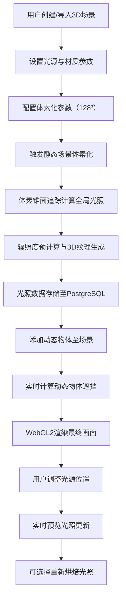

## 1. 产品概述

本系统是一个基于体素锥面追踪（Voxel Cone Tracing）技术的全局光照烘焙与动态场景融合3D交互可视化平台。系统实现高质量实时光照渲染，支持静态场景预计算光照烘焙与动态物体实时融合，为游戏开发、建筑可视化、影视特效等领域提供专业的光照解决方案。

- **核心价值**：解决传统全局光照计算耗时、动态场景难以实时渲染的技术痛点，提供高质量、可交互的全局光照解决方案
- **目标用户**：游戏引擎开发者、3D美术设计师、建筑可视化工程师、科研人员

## 2. 核心功能

### 2.1 用户角色

| 角色 | 注册方式 | 核心权限 |
|------|----------|----------|
| 开发者用户 | 系统登录 | 编辑场景、调整光源、烘焙光照、导出数据 |
| 访客用户 | 无需登录 | 浏览演示场景、查看光照效果 |

### 2.2 功能模块

1. **3D场景编辑器**：场景管理、物体创建与编辑、光源控制
2. **体素化渲染模块**：128x128x128分辨率体素化、3D纹理生成
3. **全局光照计算模块**：锥面追踪、辐照度计算、各向异性过滤
4. **光照烘焙模块**：静态场景预计算、光照数据持久化
5. **动态物体融合模块**：实时遮挡计算、动态光照更新
6. **数据管理模块**：体素数据存储、范围查询、版本管理

### 2.3 页面详情

| 页面名称 | 模块名称 | 功能描述 |
|-----------|-------------|---------------------|
| 主编辑器页面 | 3D视口 | WebGL2渲染场景、支持鼠标交互（旋转、平移、缩放） |
| 主编辑器页面 | 场景层次面板 | 场景物体树状管理、可见性控制、选择高亮 |
| 主编辑器页面 | 属性编辑面板 | 物体属性编辑、光源参数调整、材质设置 |
| 主编辑器页面 | 光照控制面板 | 体素分辨率设置、烘焙触发、光照参数调节 |
| 主编辑器页面 | 工具栏 | 操作按钮（新建/保存/导入/导出）、模式切换 |
| 数据管理页面 | 体素数据列表 | 烘焙数据浏览、版本管理、查询筛选 |
| 数据管理页面 | 数据详情 | 3D纹理可视化、数据统计、下载/删除 |
| 设置页面 | 系统设置 | 渲染参数、性能选项、缓存管理 |

## 3. 核心流程

## 4. 用户界面设计

### 4.1 设计风格

- **主色调**：深空蓝 `#0a0e1a` 作为背景，科技感青色 `#00d4ff` 作为强调色，辅以暖橙色 `#ff6b35` 标识交互元素
- **按钮风格**：极简几何风格，轻微倒角，hover时有辉光效果，active时有按压反馈
- **字体**：标题使用 `Orbitron` 科技感字体，正文使用 `JetBrains Mono` 等宽字体保证代码可读性
- **布局风格**：多面板停靠式布局，主视口居中，工具栏顶部，属性面板与层级面板分列两侧
- **视觉元素**：使用网格线、边框辉光、科技感渐变，营造专业3D编辑器氛围

### 4.2 页面设计概述

| 页面名称 | 模块名称 | UI元素 |
|-----------|-------------|-------------|
| 主编辑器页面 | 3D视口 | 深色背景、网格辅助线、Gizmo操纵器、FPS性能显示、全屏切换按钮 |
| 主编辑器页面 | 场景层次面板 | 树状列表、折叠/展开、拖拽排序、右键菜单、搜索框 |
| 主编辑器页面 | 属性编辑面板 | 分组折叠、滑块控件、颜色选择器、数值输入框、实时预览 |
| 主编辑器页面 | 光照控制面板 | 烘焙进度条、分辨率选择器、质量预设、高级参数折叠区 |
| 主编辑器页面 | 工具栏 | 图标按钮、模式切换、快捷操作、面包屑导航 |
| 数据管理页面 | 体素数据列表 | 卡片式布局、缩略图预览、标签筛选、分页器 |
| 设置页面 | 系统设置 | 分类标签页、开关控件、数值输入、重置按钮 |

### 4.3 响应性

- **桌面优先**：针对1920x1080及以上分辨率优化，支持多面板自由拖拽布局
- **移动适配**：在平板设备上简化面板布局，触摸优化交互
- **性能模式**：低配置设备自动降级渲染分辨率，关闭高级后处理效果

### 4.4 3D场景指导

- **环境/HDRI**：使用中性灰色渐变天空，避免环境色干扰光照预览，提供可切换的HDRI环境库
- **光照设置**：默认启用1个主方向光+2个补光，光源可视化显示（线框球体/方向箭头），支持实时拖动
- **相机设置**：透视相机，FOV 60°，轨道控制器（OrbitControls），支持飞行模式切换
- **构图与焦点**：场景居中展示，Gizmo显示在视口右上角，光照效果通过可交互的示例模型（Sponza宫殿、Cornell Box）展示
- **交互与动画**：物体选中时边缘高亮，光源移动时光照实时更新，烘焙时显示体素化进度动画
- **后处理效果**：Bloom泛光、TAA抗锯齿、色调映射、自动曝光，可在设置中开关
- **性能预算**：静态场景三角面≤50万，动态物体≤5个，体素化时间≤10秒，实时帧率≥60 FPS
