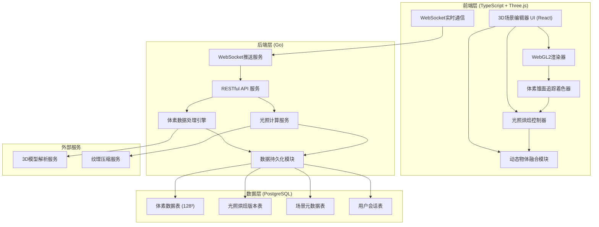
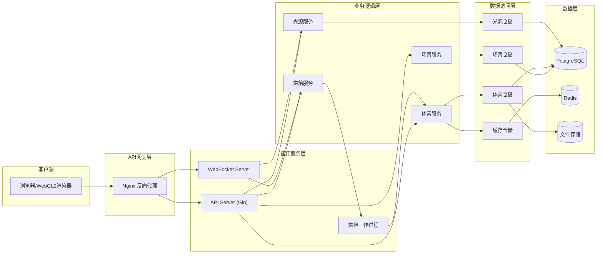

## 1. 架构设计



## 2. 技术描述

### 2.1 前端技术栈
- **框架**: React 18 + TypeScript 5.4
- **构建工具**: Vite 5.2
- **3D渲染**: Three.js r160 + WebGL2
- **UI组件**: Ant Design 5.15 + TailwindCSS 3.4
- **状态管理**: Zustand 4.5
- **着色器**: GLSL ES 3.00 (自定义VCT着色器)
- **实时通信**: WebSocket API

### 2.2 后端技术栈
- **语言**: Go 1.22
- **Web框架**: Gin 1.9
- **数据库驱动**: pgx v5 + GORM 1.26
- **3D计算**: go3d (自定义体素处理库)
- **WebSocket**: gorilla/websocket 1.5
- **认证**: JWT + bcrypt

### 2.3 数据库
- **PostgreSQL 16** with pg_cube 扩展 (支持3D范围查询)
- **Redis 7** (缓存热点体素数据、会话管理)

### 2.4 核心技术点
- **体素化**: GPU加速的3D光栅化，128x128x128分辨率
- **锥面追踪**: 6方向半球采样 + 各向异性过滤
- **光照烘焙**: 球谐函数(SH)投影 + 3D纹理压缩
- **动态融合**: 深度缓冲区比较 + 实时遮挡计算
- **数据查询**: PostgreSQL 3D空间索引 + 范围查询优化

## 3. 路由定义

| 路由 | 方法 | 用途 | 鉴权 |
|-------|------|---------|------|
| /api/v1/scenes | GET | 获取场景列表 | 是 |
| /api/v1/scenes | POST | 创建新场景 | 是 |
| /api/v1/scenes/:id | GET | 获取场景详情 | 是 |
| /api/v1/scenes/:id | PUT | 更新场景配置 | 是 |
| /api/v1/scenes/:id | DELETE | 删除场景 | 是 |
| /api/v1/voxel/bake | POST | 触发光照烘焙 | 是 |
| /api/v1/voxel/bake/:taskId | GET | 查询烘焙进度 | 是 |
| /api/v1/voxel/data/:sceneId | GET | 获取体素数据 | 是 |
| /api/v1/voxel/query | POST | 范围查询体素 | 是 |
| /api/v1/lights | GET | 获取光源列表 | 是 |
| /api/v1/lights | POST | 创建光源 | 是 |
| /api/v1/lights/:id | PUT | 更新光源位置/参数 | 是 |
| /api/v1/lights/:id | DELETE | 删除光源 | 是 |
| /api/v1/objects/dynamic | POST | 注册动态物体 | 是 |
| /api/v1/objects/dynamic/:id | PUT | 更新动态物体位置 | 是 |
| /api/v1/auth/login | POST | 用户登录 | 否 |
| /api/v1/auth/logout | POST | 用户登出 | 是 |
| /ws | GET | WebSocket实时连接 | 是 |

## 4. API 定义

```typescript
// 核心数据类型
interface Vec3 { x: number; y: number; z: number; }

interface VoxelData {
  x: number; y: number; z: number;
  irradiance: Vec3;
  occupancy: number;
  normal: Vec3;
}

interface LightSource {
  id: string;
  type: 'directional' | 'point' | 'spot';
  position: Vec3;
  rotation: Vec3;
  color: Vec3;
  intensity: number;
  radius?: number;
  angle?: number;
}

interface SceneConfig {
  id: string;
  name: string;
  voxelResolution: number;
  voxelSize: number;
  sceneBounds: { min: Vec3; max: Vec3 };
  objects: SceneObject[];
  lights: LightSource[];
}

interface BakeTask {
  id: string;
  sceneId: string;
  status: 'pending' | 'voxelizing' | 'tracing' | 'complete' | 'error';
  progress: number;
  startTime: number;
  endTime?: number;
}

interface DynamicObject {
  id: string;
  meshData: MeshData;
  transform: { position: Vec3; rotation: Vec3; scale: Vec3 };
  material: MaterialData;
}

// 请求/响应类型
interface BakeRequest {
  sceneId: string;
  resolution: number;
  quality: 'low' | 'medium' | 'high';
}

interface VoxelQueryRequest {
  sceneId: string;
  bounds: { min: Vec3; max: Vec3 };
  lod: number;
}

interface VoxelQueryResponse {
  data: VoxelData[];
  count: number;
  timestamp: number;
}
```

## 5. 服务器架构图



## 6. 数据模型

### 6.1 数据模型定义

```mermaid
erDiagram
    SCENES ||--o{ LIGHTS : contains
    SCENES ||--o{ SCENE_OBJECTS : contains
    SCENES ||--o{ BAKE_TASKS : has
    SCENES ||--o{ VOXEL_GRIDS : has
    VOXEL_GRIDS ||--o{ VOXEL_DATA : contains
    USERS ||--o{ SCENES : owns
    DYNAMIC_OBJECTS ||--o{ SCENES : "in"
    
    SCENES {
        uuid id PK
        varchar name
        uuid user_id FK
        int voxel_resolution
        float voxel_size
        jsonb bounds
        timestamp created_at
        timestamp updated_at
    }
    
    LIGHTS {
        uuid id PK
        uuid scene_id FK
        varchar type
        jsonb position
        jsonb rotation
        jsonb color
        float intensity
        float radius
        float angle
        boolean is_static
        timestamp created_at
        timestamp updated_at
    }
    
    SCENE_OBJECTS {
        uuid id PK
        uuid scene_id FK
        varchar name
        varchar mesh_url
        jsonb transform
        jsonb material
        boolean is_static
        timestamp created_at
    }
    
    BAKE_TASKS {
        uuid id PK
        uuid scene_id FK
        varchar status
        int progress
        jsonb params
        timestamp start_time
        timestamp end_time
        text error_message
    }
    
    VOXEL_GRIDS {
        uuid id PK
        uuid scene_id FK
        uuid bake_task_id FK
        int resolution
        jsonb bounds
        int lod_level
        timestamp created_at
    }
    
    VOXEL_DATA {
        bigint id PK
        uuid grid_id FK
        int x
        int y
        int z
        float r
        float g
        float b
        float occupancy
        float normal_x
        float normal_y
        float normal_z
    }
    
    DYNAMIC_OBJECTS {
        uuid id PK
        uuid scene_id FK
        varchar name
        jsonb mesh_data
        jsonb transform
        jsonb material
        timestamp last_updated
    }
    
    USERS {
        uuid id PK
        varchar email UNIQUE
        varchar password_hash
        varchar display_name
        timestamp created_at
    }
```

### 6.2 数据定义语言 (DDL)

```sql
-- 启用3D立方体扩展
CREATE EXTENSION IF NOT EXISTS cube;
CREATE EXTENSION IF NOT EXISTS pg_trgm;

-- 场景表
CREATE TABLE scenes (
    id UUID PRIMARY KEY DEFAULT gen_random_uuid(),
    name VARCHAR(255) NOT NULL,
    user_id UUID NOT NULL,
    voxel_resolution INTEGER NOT NULL DEFAULT 128,
    voxel_size FLOAT NOT NULL DEFAULT 0.1,
    bounds JSONB NOT NULL,
    created_at TIMESTAMPTZ NOT NULL DEFAULT NOW(),
    updated_at TIMESTAMPTZ NOT NULL DEFAULT NOW()
);

CREATE INDEX idx_scenes_user_id ON scenes(user_id);

-- 光源表
CREATE TABLE lights (
    id UUID PRIMARY KEY DEFAULT gen_random_uuid(),
    scene_id UUID NOT NULL REFERENCES scenes(id) ON DELETE CASCADE,
    type VARCHAR(32) NOT NULL CHECK (type IN ('directional', 'point', 'spot')),
    position JSONB NOT NULL,
    rotation JSONB NOT NULL,
    color JSONB NOT NULL DEFAULT '{"x":1,"y":1,"z":1}',
    intensity FLOAT NOT NULL DEFAULT 1.0,
    radius FLOAT,
    angle FLOAT,
    is_static BOOLEAN NOT NULL DEFAULT true,
    created_at TIMESTAMPTZ NOT NULL DEFAULT NOW(),
    updated_at TIMESTAMPTZ NOT NULL DEFAULT NOW()
);

CREATE INDEX idx_lights_scene_id ON lights(scene_id);

-- 场景物体表
CREATE TABLE scene_objects (
    id UUID PRIMARY KEY DEFAULT gen_random_uuid(),
    scene_id UUID NOT NULL REFERENCES scenes(id) ON DELETE CASCADE,
    name VARCHAR(255) NOT NULL,
    mesh_url VARCHAR(1024),
    transform JSONB NOT NULL,
    material JSONB NOT NULL,
    is_static BOOLEAN NOT NULL DEFAULT true,
    created_at TIMESTAMPTZ NOT NULL DEFAULT NOW()
);

CREATE INDEX idx_scene_objects_scene_id ON scene_objects(scene_id);

-- 烘焙任务表
CREATE TABLE bake_tasks (
    id UUID PRIMARY KEY DEFAULT gen_random_uuid(),
    scene_id UUID NOT NULL REFERENCES scenes(id) ON DELETE CASCADE,
    status VARCHAR(32) NOT NULL DEFAULT 'pending'
        CHECK (status IN ('pending', 'voxelizing', 'tracing', 'complete', 'error')),
    progress INTEGER NOT NULL DEFAULT 0,
    params JSONB NOT NULL,
    start_time TIMESTAMPTZ,
    end_time TIMESTAMPTZ,
    error_message TEXT
);

CREATE INDEX idx_bake_tasks_scene_id ON bake_tasks(scene_id);
CREATE INDEX idx_bake_tasks_status ON bake_tasks(status);

-- 体素网格表
CREATE TABLE voxel_grids (
    id UUID PRIMARY KEY DEFAULT gen_random_uuid(),
    scene_id UUID NOT NULL REFERENCES scenes(id) ON DELETE CASCADE,
    bake_task_id UUID REFERENCES bake_tasks(id) ON DELETE SET NULL,
    resolution INTEGER NOT NULL,
    bounds JSONB NOT NULL,
    lod_level INTEGER NOT NULL DEFAULT 0,
    created_at TIMESTAMPTZ NOT NULL DEFAULT NOW()
);

CREATE INDEX idx_voxel_grids_scene_id ON voxel_grids(scene_id);

-- 体素数据表 (使用分区表优化)
CREATE TABLE voxel_data (
    id BIGSERIAL PRIMARY KEY,
    grid_id UUID NOT NULL REFERENCES voxel_grids(id) ON DELETE CASCADE,
    x INTEGER NOT NULL,
    y INTEGER NOT NULL,
    z INTEGER NOT NULL,
    r FLOAT NOT NULL DEFAULT 0,
    g FLOAT NOT NULL DEFAULT 0,
    b FLOAT NOT NULL DEFAULT 0,
    occupancy FLOAT NOT NULL DEFAULT 0,
    normal_x FLOAT NOT NULL DEFAULT 0,
    normal_y FLOAT NOT NULL DEFAULT 0,
    normal_z FLOAT NOT NULL DEFAULT 0
) PARTITION BY HASH (grid_id);

-- 创建64个分区 (针对128x128x128 = 2M体素优化)
DO $$
BEGIN
    FOR i IN 0..63 LOOP
        EXECUTE format(
            'CREATE TABLE voxel_data_part_%s PARTITION OF voxel_data FOR VALUES WITH (MODULUS 64, REMAINDER %s)',
            i, i
        );
    END LOOP;
END $$;

CREATE UNIQUE INDEX idx_voxel_data_grid_xyz ON voxel_data(grid_id, x, y, z);
CREATE INDEX idx_voxel_data_grid_id ON voxel_data(grid_id);

-- 动态物体表
CREATE TABLE dynamic_objects (
    id UUID PRIMARY KEY DEFAULT gen_random_uuid(),
    scene_id UUID NOT NULL REFERENCES scenes(id) ON DELETE CASCADE,
    name VARCHAR(255) NOT NULL,
    mesh_data JSONB NOT NULL,
    transform JSONB NOT NULL,
    material JSONB NOT NULL,
    last_updated TIMESTAMPTZ NOT NULL DEFAULT NOW()
);

CREATE INDEX idx_dynamic_objects_scene_id ON dynamic_objects(scene_id);

-- 用户表
CREATE TABLE users (
    id UUID PRIMARY KEY DEFAULT gen_random_uuid(),
    email VARCHAR(255) NOT NULL UNIQUE,
    password_hash VARCHAR(255) NOT NULL,
    display_name VARCHAR(255),
    created_at TIMESTAMPTZ NOT NULL DEFAULT NOW()
);

-- 触发器：自动更新updated_at
CREATE OR REPLACE FUNCTION update_updated_at()
RETURNS TRIGGER AS $$
BEGIN
    NEW.updated_at = NOW();
    RETURN NEW;
END;
$$ LANGUAGE plpgsql;

CREATE TRIGGER trigger_scenes_update
    BEFORE UPDATE ON scenes
    FOR EACH ROW EXECUTE FUNCTION update_updated_at();

CREATE TRIGGER trigger_lights_update
    BEFORE UPDATE ON lights
    FOR EACH ROW EXECUTE FUNCTION update_updated_at();

-- 初始化测试用户
INSERT INTO users (email, password_hash, display_name)
VALUES ('demo@example.com', 
        '$2a$10$N9qo8uLOickgx2ZMRZoMyeIjZAgcfl7p92ldGxad68LJZdL17lhWy', 
        '演示用户')
ON CONFLICT DO NOTHING;
```
