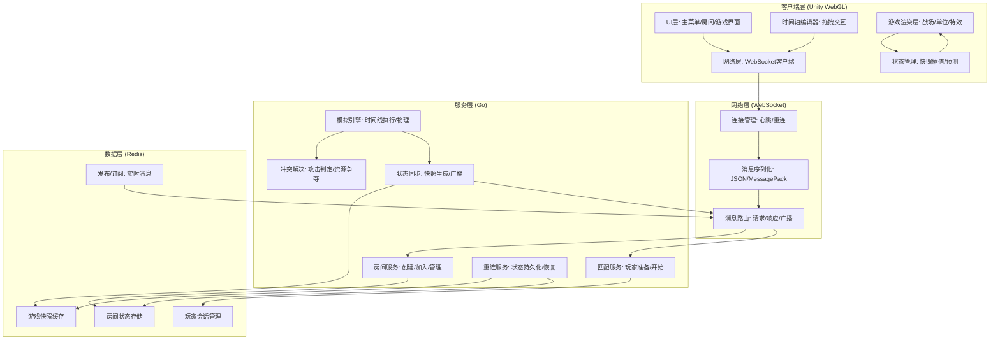
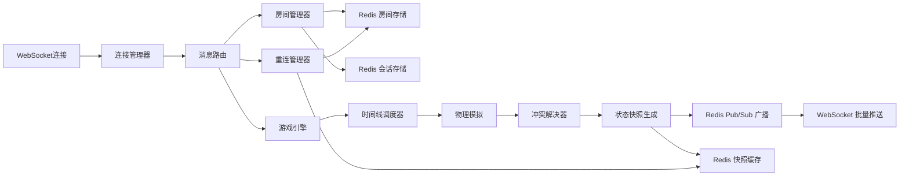
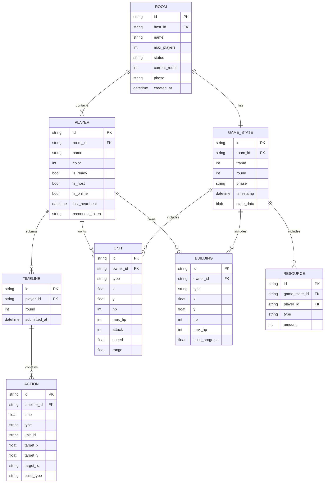

## 1. 架构设计



---

## 2. 技术描述

### 2.1 技术栈选择

| 层级 | 技术 | 版本 | 用途 |
|------|------|------|------|
| 前端 | Unity | 2022.3 LTS | 游戏引擎，WebGL导出 |
| 前端 | C# | 9.0 | Unity脚本语言 |
| 前端 | TextMeshPro | 3.0.6 | UI文本渲染 |
| 后端 | Go | 1.21+ | 服务器语言 |
| 后端 | Gorilla WebSocket | v1.5.0 | WebSocket服务器 |
| 后端 | go-redis | v9.0.0 | Redis客户端 |
| 数据存储 | Redis | 7.0+ | 状态缓存、Pub/Sub |
| 序列化 | MessagePack | - | 高效二进制序列化 |

### 2.2 项目结构

```
timeline-wars/
├── server/                    # Go后端服务
│   ├── cmd/
│   │   └── main.go           # 服务入口
│   ├── internal/
│   │   ├── room/             # 房间系统
│   │   ├── game/             # 游戏模拟引擎
│   │   ├── simulation/       # 时间线模拟
│   │   ├── conflict/         # 冲突解决
│   │   ├── sync/             # 状态同步
│   │   ├── reconnect/        # 重连机制
│   │   ├── ws/               # WebSocket服务
│   │   └── redis/            # Redis封装
│   ├── pkg/
│   │   └── protocol/         # 协议定义
│   └── go.mod
├── unity-client/             # Unity客户端项目
│   ├── Assets/
│   │   ├── Scripts/
│   │   │   ├── Network/      # WebSocket网络层
│   │   │   ├── UI/           # 界面系统
│   │   │   ├── Timeline/     # 时间轴编辑器
│   │   │   ├── Game/         # 游戏逻辑
│   │   │   └── Sync/         # 状态同步
│   │   └── Scenes/
│   └── Packages/
└── shared/                   # 共享数据结构
    └── protocol/             # 协议定义(MessagePack)
```

---

## 3. 核心协议定义

### 3.1 消息类型枚举

```go
// MessageType 消息类型
type MessageType int

const (
    // 房间消息
    MsgCreateRoom   MessageType = 1001 // 创建房间
    MsgJoinRoom     MessageType = 1002 // 加入房间
    MsgLeaveRoom    MessageType = 1003 // 离开房间
    MsgPlayerReady  MessageType = 1004 // 玩家准备
    MsgStartGame    MessageType = 1005 // 开始游戏
    MsgRoomInfo     MessageType = 1006 // 房间信息广播
    MsgPlayerList   MessageType = 1007 // 玩家列表更新

    // 游戏消息
    MsgPlanningPhase  MessageType = 2001 // 规划阶段开始
    MsgTimelineSubmit MessageType = 2002 // 提交时间线
    MsgSimulatePhase  MessageType = 2003 // 模拟阶段开始
    MsgStateSnapshot  MessageType = 2004 // 状态快照
    MsgGameOver       MessageType = 2005 // 游戏结束

    // 系统消息
    MsgHeartbeat  MessageType = 3001 // 心跳
    MsgReconnect  MessageType = 3002 // 重连请求
    MsgFullState  MessageType = 3003 // 完整状态同步
    MsgError      MessageType = 3004 // 错误消息
)
```

### 3.2 数据结构定义

```go
// Player 玩家信息
type Player struct {
    ID       string `msgpack:"id"`
    Name     string `msgpack:"name"`
    RoomID   string `msgpack:"room_id"`
    Color    int    `msgpack:"color"`
    IsReady  bool   `msgpack:"is_ready"`
    IsHost   bool   `msgpack:"is_host"`
    IsOnline bool   `msgpack:"is_online"`
}

// Action 单个操作
type Action struct {
    Time      float64       `msgpack:"time"`      // 时间点 (0-5秒)
    Type      ActionType    `msgpack:"type"`      // 操作类型
    UnitID    string        `msgpack:"unit_id"`   // 操作单位ID
    TargetX   float64       `msgpack:"target_x"`  // 目标位置X
    TargetY   float64       `msgpack:"target_y"`  // 目标位置Y
    TargetID  string        `msgpack:"target_id"` // 目标单位/建筑ID
    BuildType BuildingType  `msgpack:"build_type"`// 建造类型
}

// Timeline 玩家时间线
type Timeline struct {
    PlayerID string   `msgpack:"player_id"`
    Actions  []Action `msgpack:"actions"`
    SubmittedAt int64 `msgpack:"submitted_at"`
}

// Unit 游戏单位
type Unit struct {
    ID        string  `msgpack:"id"`
    OwnerID   string  `msgpack:"owner_id"`
    Type      UnitType `msgpack:"type"`
    X         float64 `msgpack:"x"`
    Y         float64 `msgpack:"y"`
    HP        int     `msgpack:"hp"`
    MaxHP     int     `msgpack:"max_hp"`
    Attack    int     `msgpack:"attack"`
    Speed     float64 `msgpack:"speed"`
    Range     float64 `msgpack:"range"`
}

// Building 建筑
type Building struct {
    ID        string       `msgpack:"id"`
    OwnerID   string       `msgpack:"owner_id"`
    Type      BuildingType `msgpack:"type"`
    X         float64      `msgpack:"x"`
    Y         float64      `msgpack:"y"`
    HP        int          `msgpack:"hp"`
    MaxHP     int          `msgpack:"max_hp"`
    BuildProgress float64  `msgpack:"build_progress"` // 0-1
}

// GameState 游戏状态快照
type GameState struct {
    Frame     int        `msgpack:"frame"`
    Timestamp int64      `msgpack:"timestamp"`
    Units     []Unit     `msgpack:"units"`
    Buildings []Building `msgpack:"buildings"`
    Resources map[string]int `msgpack:"resources"`
    Phase     GamePhase  `msgpack:"phase"`
    Round     int        `msgpack:"round"`
    PlanningTimeLeft float64 `msgpack:"planning_time_left"`
}

// FullGameState 完整游戏状态(用于重连)
type FullGameState struct {
    RoomID    string      `msgpack:"room_id"`
    Players   []Player    `msgpack:"players"`
    GameState GameState   `msgpack:"game_state"`
    CurrentTimelines map[string]Timeline `msgpack:"current_timelines"`
    LastFrame int       `msgpack:"last_frame"`
}
```

---

## 4. 服务器架构



### 4.1 核心模块职责

| 模块 | 职责 | 关键技术点 |
|------|------|------------|
| 连接管理器 | WebSocket连接维护、心跳检测、断开检测 | 心跳超时5秒，自动重连检测 |
| 房间管理器 | 房间创建/销毁、玩家加入/离开、状态流转 | 房间号生成、人数限制(2-4人) |
| 时间线调度器 | 收集玩家时间线、排序、触发模拟 | 超时提交处理、并行模拟 |
| 物理模拟 | 单位移动、攻击计算、建造进度 | 固定步长(50ms)、确定性模拟 |
| 冲突解决器 | 攻击判定、资源争夺、建造冲突 | 优先级排序、时间戳优先、随机数种子一致 |
| 状态同步 | 快照生成、差值压缩、广播 | 20fps、增量同步、关键帧完整同步 |
| 重连管理器 | 掉线标记、状态持久化、重连恢复 | 30秒超时、完整快照发送 |

---

## 5. 数据模型

### 5.1 ER图



### 5.2 Redis键设计

```
# 房间信息
room:{room_id}          -> Hash (房间基本信息)
room:{room_id}:players  -> Set (玩家ID集合)
room:{room_id}:state    -> String (序列化GameState)

# 玩家会话
player:{player_id}         -> Hash (玩家信息)
player:{player_id}:room    -> String (所在房间ID)
player:{player_id}:token   -> String (重连令牌)

# 游戏状态
room:{room_id}:snapshots        -> List (最近100帧快照)
room:{room_id}:timelines:{round} -> Hash (本回合所有玩家时间线)

# Pub/Sub频道
room:{room_id}:broadcast    -> 房间内广播频道
player:{player_id}:private  -> 玩家私有频道
```

---

## 6. 核心算法

### 6.1 确定性模拟算法

```go
// SimulationEngine 确定性模拟引擎
type SimulationEngine struct {
    randomSeed int64
    frameTime  float64 // 0.05秒 (20fps)
}

// Simulate 执行5秒模拟，返回100帧状态
func (e *SimulationEngine) Simulate(
    initialState GameState,
    timelines map[string]Timeline,
    duration float64,
) []GameState {
    frames := make([]GameState, 0, int(duration/e.frameTime))
    state := initialState
    
    // 排序所有操作
    allActions := e.collectAndSortActions(timelines)
    
    // 逐帧模拟
    for t := 0.0; t < duration; t += e.frameTime {
        // 1. 执行当前时间点的操作
        actions := e.getActionsAtTime(allActions, t)
        state = e.executeActions(state, actions)
        
        // 2. 物理更新(移动、攻击、建造)
        state = e.physicsUpdate(state, e.frameTime)
        
        // 3. 冲突检测与解决
        state = e.resolveConflicts(state)
        
        // 4. 检查胜负
        if e.checkGameOver(state) {
            state.Phase = PhaseGameOver
            frames = append(frames, state)
            break
        }
        
        frames = append(frames, state)
    }
    
    return frames
}
```

### 6.2 冲突解决策略

```go
// ConflictResolver 冲突解决器
type ConflictResolver struct{}

// Resolve 解决当前帧所有冲突
func (r *ConflictResolver) Resolve(state GameState) GameState {
    // 1. 攻击冲突：同一时间多个单位攻击同一目标
    attackConflicts := r.findAttackConflicts(state)
    for _, conflict := range attackConflicts {
        // 按攻击力排序，依次结算
        sort.Slice(conflict.Attackers, func(i, j int) bool {
            return conflict.Attackers[i].Attack > conflict.Attackers[j].Attack
        })
        state = r.resolveAttackConflict(state, conflict)
    }
    
    // 2. 资源冲突：多个单位争夺同一资源点
    resourceConflicts := r.findResourceConflicts(state)
    for _, conflict := range resourceConflicts {
        // 距离优先，距离相同则单位数量优先
        state = r.resolveResourceConflict(state, conflict)
    }
    
    // 3. 建造冲突：同一位置建造多个建筑
    buildConflicts := r.findBuildConflicts(state)
    for _, conflict := range buildConflicts {
        // 先提交的时间线优先
        sort.Slice(conflict.Buildings, func(i, j int) bool {
            return conflict.Buildings[i].SubmittedAt < conflict.Buildings[j].SubmittedAt
        })
        state = r.resolveBuildConflict(state, conflict)
    }
    
    return state
}
```

### 6.3 状态同步优化

```go
// StateSynchronizer 状态同步器
type StateSynchronizer struct {
    snapshotInterval int // 每N帧发送完整快照，其余发送增量
}

// GenerateDelta 生成两个状态的差值
func (s *StateSynchronizer) GenerateDelta(prev, curr GameState) DeltaMessage {
    delta := DeltaMessage{
        Frame: curr.Frame,
        Timestamp: curr.Timestamp,
    }
    
    // 找出变化的单位
    prevUnits := make(map[string]Unit)
    for _, u := range prev.Units {
        prevUnits[u.ID] = u
    }
    
    for _, u := range curr.Units {
        if prev, ok := prevUnits[u.ID]; !ok || !u.Equals(prev) {
            delta.UpdatedUnits = append(delta.UpdatedUnits, u)
        }
        delete(prevUnits, u.ID)
    }
    
    // 移除的单位
    for id := range prevUnits {
        delta.RemovedUnits = append(delta.RemovedUnits, id)
    }
    
    // 建筑同理...
    
    return delta
}
```
