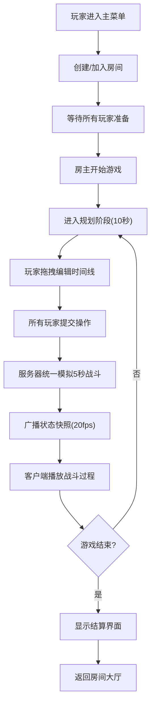
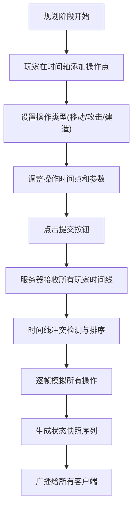
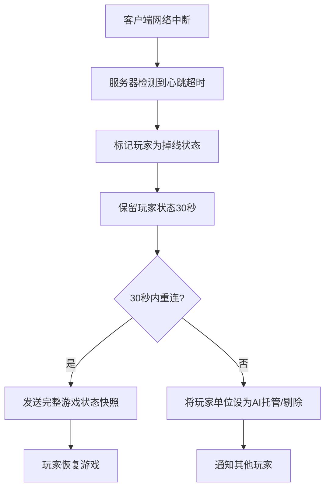

## 1. 产品概述

**时间线战争 (Timeline Wars)** 是一款局域网多人即时策略游戏，创新地采用"预录制时间线+统一模拟"的回合制与即时制结合的玩法。每个玩家在每回合预录制未来5秒内的操作（移动、攻击、建造），所有玩家同时提交时间线后，服务器统一模拟所有操作并广播结果。

- **核心玩法**：时间线规划 + 即时策略 + 多人对战
- **目标用户**：局域网聚会玩家、策略游戏爱好者
- **市场价值**：填补局域网即时策略游戏的创新玩法空白，提供独特的"预判对手"策略体验

---

## 2. 核心功能

### 2.1 用户角色

| 角色 | 加入方式 | 核心权限 |
|------|----------|----------|
| 房主 | 创建房间 | 设置游戏参数、开始游戏、踢出玩家 |
| 玩家 | 输入房间号加入 | 预录制操作、提交时间线、参与对战 |
| 观战者 | 加入房间选择观战 | 观看对局、查看所有玩家时间线 |

### 2.2 功能模块

1. **房间系统**：房间创建/加入、玩家列表、房间设置、游戏开始控制
2. **时间线编辑器**：5秒时间轴可视化、操作点拖拽编辑、操作类型选择
3. **游戏模拟**：单位移动、攻击判定、建筑建造、资源争夺
4. **状态同步**：20fps状态快照广播、预测回放、结果展示
5. **重连机制**：掉线检测、状态恢复、30秒重连窗口

### 2.3 页面详情

| 页面名称 | 模块名称 | 功能描述 |
|----------|----------|----------|
| 主菜单 | 房间入口 | 创建房间、输入房间号加入、本地IP显示 |
| 房间大厅 | 玩家管理 | 玩家列表、准备状态、开始游戏按钮、房间设置 |
| 游戏主界面 | 战场视图 | 单位显示、地形渲染、建筑展示、特效播放 |
| 游戏主界面 | 时间轴编辑器 | 5秒时间轴、操作点拖拽、操作类型面板、提交按钮 |
| 游戏主界面 | 资源面板 | 资源数量、单位列表、建造菜单 |
| 结算界面 | 结果展示 | 胜负判定、数据统计、返回大厅按钮 |

---

## 3. 核心流程

### 3.1 游戏主流程

### 3.2 时间线提交流程

### 3.3 掉线重连流程

---

## 4. 用户界面设计

### 4.1 设计风格

- **主色调**：深空蓝 (#0F172A) 作为主背景，赛博青 (#06B6D4) 作为主强调色，警示红 (#EF4444) 用于敌方和警告，能量黄 (#F59E0B) 用于资源和选中
- **按钮风格**：科技感边框 + 渐变填充，悬停时有发光效果，圆角8px
- **字体**：
  - 标题：Orbitron（赛博朋克风格等宽字体）
  - 正文：Rajdhani（清晰易读的无衬线字体）
  - 数字：JetBrains Mono（等宽数字字体）
- **布局风格**：全息投影风格界面，半透明玻璃态面板，网格线背景，科技感HUD元素
- **图标风格**：线性描边图标，发光效果，游戏内单位使用低多边形风格

### 4.2 页面设计概述

| 页面名称 | 模块名称 | UI元素 |
|----------|----------|--------|
| 主菜单 | 房间入口 | 居中大标题"时间线战争"，动态网格背景，创建/加入按钮卡片，本地IP地址显示栏 |
| 房间大厅 | 玩家管理 | 左侧玩家列表（含头像、准备状态），右侧房间设置面板，底部开始游戏按钮，房间号显示和复制 |
| 游戏主界面 | 战场视图 | 顶视角度战场，网格地形，单位带血条和所属颜色标记，攻击/建造特效，小地图 |
| 游戏主界面 | 时间轴编辑器 | 底部固定时间轴面板，5秒刻度，可拖拽操作点，左侧操作类型选择（移动/攻击/建造），右侧提交按钮，倒计时显示 |
| 游戏主界面 | 资源面板 | 左上角资源显示（水晶、能量），左下角单位列表，右下角建造菜单 |
| 结算界面 | 结果展示 | 全屏半透明遮罩，居中胜负标题，详细数据统计表格，返回大厅和再来一局按钮 |

### 4.3 响应式设计

- **桌面优先**：主要针对PC桌面端设计，Unity WebGL全屏运行
- **分辨率**：最低支持1280x720，推荐1920x1080
- **UI缩放**：根据屏幕分辨率自动缩放UI元素
- **触控支持**：时间轴支持触摸拖拽，战场支持双指缩放

### 4.4 3D场景设计

- **环境风格**：科幻战场，低多边形风格，模块化地形组件
- **HDRI和氛围**：暗色调环境光，蓝色调雾效，单位和建筑有自发光材质
- **光照设置**：主方向光 + 半球光环境，单位添加点光源光晕，战场边缘有体积光效果
- **相机设置**：固定正交俯视视角，可缩放，平滑跟随战场中心
- **构图和焦点**：战场居中，UI环绕四周，重要单位有高亮描边
- **交互和动画**：单位选中有弹跳动画，攻击有射线特效，建造有扫描线效果，时间线操作点有脉冲发光
- **后处理效果**：Bloom泛光，轻微色差，扫描线效果，战斗时增加对比度
- **资源来源**：使用Unity Asset Store免费资源，程序化生成地形和特效，性能预算控制在Draw Call < 300
